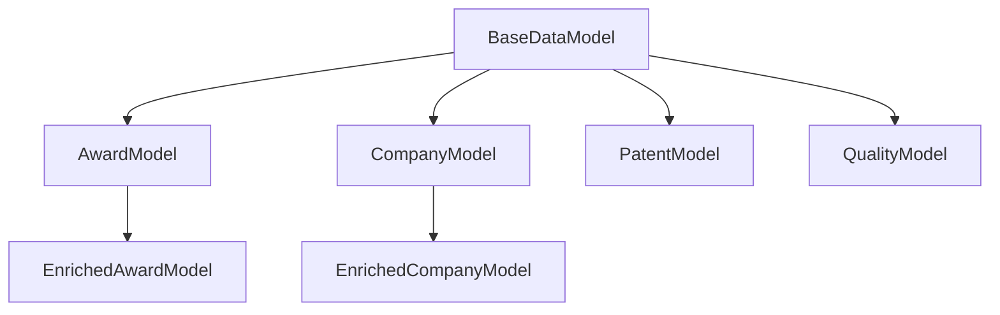

# Design Document

## Overview

This design outlines a comprehensive consolidation and refactoring strategy for the SBIR ETL pipeline codebase. The approach focuses on reducing complexity, eliminating duplication, and establishing consistent architectural patterns while maintaining all existing functionality. The design emphasizes incremental migration paths to minimize disruption to ongoing development.

## Architecture

### Current State Analysis

The current codebase exhibits several patterns that indicate organic growth:
- **Asset Proliferation**: 15+ asset files with overlapping responsibilities including:
  - Multiple ingestion assets: `sbir_ingestion.py`, `usaspending_ingestion.py`, `uspto_ai_extraction_assets.py`
  - Separate Neo4j loading assets: `cet_neo4j_loading_assets.py`, `transition_neo4j_loading_assets.py`, `uspto_neo4j_loading_assets.py`
  - Fragmented validation and transformation: `uspto_validation_assets.py`, `uspto_transformation_assets.py`
- **Configuration Fragmentation**: Multiple configuration classes scattered across modules:
  - 16+ separate Config classes in `src/config/schemas.py`
  - Duplicate Neo4j configurations in multiple files
  - Inconsistent validation configurations across validators
- **Utility Duplication**: Similar functions scattered across different modules in `src/utils/`
- **Testing Inconsistency**: Different test patterns and setup approaches across unit, integration, and E2E tests
- **Performance Monitoring Scatter**: Performance tracking code duplicated across assets and utilities

### Target Architecture

The consolidated architecture will follow a layered approach with clear separation of concerns:

```
src/
├── core/                    # Consolidated core functionality
│   ├── assets/             # Unified asset definitions
│   ├── config/             # Single configuration system
│   ├── models/             # Consolidated data models
│   └── monitoring/         # Unified performance monitoring
├── pipeline/               # Pipeline-specific logic
│   ├── extraction/         # Data extraction components
│   ├── enrichment/         # Data enrichment components
│   ├── transformation/     # Data transformation components
│   └── loading/            # Data loading components
├── shared/                 # Shared utilities and helpers
│   ├── database/           # Database clients and utilities
│   ├── validation/         # Validation logic
│   └── utils/              # Common utilities
└── tests/                  # Unified testing framework
    ├── fixtures/           # Shared test fixtures
    ├── helpers/            # Test utilities
    └── scenarios/          # Test scenarios
```

## Components and Interfaces

### 1. Asset Consolidation System

**Core Interface:**
```python
class ConsolidatedAsset:
    """Base class for consolidated pipeline assets."""
    
    def __init__(self, config: PipelineConfig, monitor: PerformanceMonitor):
        self.config = config
        self.monitor = monitor
    
    def execute(self, context: AssetExecutionContext) -> AssetMaterialization:
        """Execute asset with unified monitoring and error handling."""
        pass
```

**Asset Groups:**
- **Ingestion Assets**: Consolidate `sbir_ingestion.py`, `usaspending_ingestion.py`, `uspto_ai_extraction_assets.py`, `uspto_assets.py`
- **Validation Assets**: Merge `uspto_validation_assets.py` with validation logic across all data sources
- **Enrichment Assets**: Unify `sbir_usaspending_enrichment.py` with other enrichment patterns
- **Transformation Assets**: Consolidate `uspto_transformation_assets.py`, `transition_assets.py`, and graph preparation logic
- **Loading Assets**: Merge `cet_neo4j_loading_assets.py`, `transition_neo4j_loading_assets.py`, `uspto_neo4j_loading_assets.py` with consistent patterns

### 2. Unified Configuration System

**Configuration Hierarchy:**
```python
class CoreConfig(BaseModel):
    """Core configuration shared across all components."""
    environment: str
    debug: bool
    log_level: str

class DatabaseConfig(BaseModel):
    """Unified database configuration consolidating multiple Neo4j configs."""
    neo4j: Neo4jConfig  # Consolidate from loaders/neo4j_client.py and config/schemas.py
    duckdb: DuckDBConfig  # Merge SbirDuckDBConfig and DuckDBConfig

class ConsolidatedPipelineConfig(BaseModel):
    """Root configuration consolidating 16+ existing config classes."""
    core: CoreConfig
    databases: DatabaseConfig
    data_quality: DataQualityConfig  # Merge ValidationConfig classes
    enrichment: EnrichmentConfig
    extraction: ExtractionConfig
    transformation: TransformationConfig
    logging: LoggingConfig
    metrics: MetricsConfig
    statistical_reporting: StatisticalReportingConfig
    taxonomy: TaxonomyConfig  # From ml/config/taxonomy_loader.py
    classification: ClassificationConfig  # From ml/config/taxonomy_loader.py
```

**Configuration Loading Strategy:**
- Single configuration loader consolidating existing `config/loader.py` functionality
- Environment-specific overrides maintaining existing `config/base.yaml`, `config/dev.yaml` patterns
- Type-safe validation with clear error messages leveraging existing Pydantic validation
- Consistent environment variable naming (SBIR_ETL__ prefix) standardizing current mixed patterns
- Hot-reload capability for development environments

**Migration from Current State:**
- Consolidate 16+ separate Config classes in `src/config/schemas.py` into hierarchical structure
- Merge duplicate Neo4j configurations from `loaders/neo4j_client.py` and `config/schemas.py`
- Unify validation configurations from `validators/schemas.py` and main config
- Preserve existing configuration values and environment variable patterns during transition

### 3. Unified Testing Framework

**Test Infrastructure:**
```python
class PipelineTestCase:
    """Base test case with common setup and utilities."""
    
    @pytest.fixture
    def pipeline_config(self) -> PipelineConfig:
        """Provide test configuration."""
        pass
    
    @pytest.fixture
    def mock_databases(self) -> DatabaseMocks:
        """Provide mocked database connections."""
        pass
    
    @pytest.fixture
    def test_data_manager(self) -> TestDataManager:
        """Provide test data management."""
        pass
```

**Test Categories:**
- **Unit Tests**: Component-level testing with mocked dependencies
- **Integration Tests**: Multi-component testing with real databases
- **E2E Tests**: Full pipeline testing with containerized environment
- **Performance Tests**: Resource usage and timing validation

### 4. Performance Monitoring System

**Monitoring Architecture:**
```python
class UnifiedPerformanceMonitor:
    """Centralized performance monitoring for all pipeline components."""
    
    def track_asset_execution(self, asset_name: str) -> ContextManager:
        """Track asset execution with memory and timing."""
        pass
    
    def track_database_operation(self, operation: str) -> ContextManager:
        """Track database operations."""
        pass
    
    def generate_performance_report(self) -> PerformanceReport:
        """Generate comprehensive performance report."""
        pass
```

**Monitoring Features:**
- Automatic memory usage tracking
- Database operation timing
- Asset execution metrics
- Resource utilization alerts
- Performance regression detection

### 5. Data Model Consolidation

**Model Hierarchy:**
```python
class BaseDataModel(BaseModel):
    """Base model with common validation and serialization."""
    
    class Config:
        validate_assignment = True
        str_strip_whitespace = True
        json_encoders = {date: lambda v: v.isoformat()}

class AwardModel(BaseDataModel):
    """Consolidated award model for SBIR/STTR awards."""
    pass

class CompanyModel(BaseDataModel):
    """Consolidated company model with enrichment fields."""
    pass

class PatentModel(BaseDataModel):
    """Consolidated patent model with relationships."""
    pass
```

### 6. Docker and Deployment Consolidation

**Current Docker Configuration State:**
- Multiple Docker Compose files: `docker/docker-compose.dev.yml`, `docker/docker-compose.e2e.yml`, `docker/docker-compose.test.yml`
- Root-level compose files: `docker-compose.yml`, `docker-compose.cet-staging.yml`
- Inconsistent environment variable management across containers
- Varying resource limits and health check patterns

**Consolidated Docker Architecture:**
```yaml
# Single docker-compose.yml with profile-based environments
services:
  app:
    profiles: ["dev", "test", "prod"]
    environment:
      - SBIR_ETL_ENV=${COMPOSE_PROFILE:-dev}
    # Unified resource limits and health checks
    
  neo4j:
    profiles: ["dev", "test", "prod"]
    # Standardized Neo4j configuration
    
# Environment-specific overrides via profiles
```

**Docker Consolidation Strategy:**
- Merge redundant compose files into single `docker-compose.yml` with profiles
- Standardize environment variable patterns using `SBIR_ETL__` prefix
- Unify container resource limits and health check configurations
- Consolidate build stages and optimize layer caching
- Create consistent startup and dependency management patterns

## Data Models

### Consolidated Model Structure

**Core Models:**
- `BaseDataModel`: Common validation and serialization patterns
- `AwardModel`: Unified SBIR/STTR award representation
- `CompanyModel`: Company data with enrichment capabilities
- `PatentModel`: Patent data with relationship tracking
- `QualityModel`: Data quality metrics and validation results

**Model Relationships:**


**Validation Strategy:**
- Shared validators for common patterns (UEI, DUNS, dates)
- Hierarchical validation with clear error reporting
- Performance-optimized validation for large datasets
- Configurable validation strictness levels

## Error Handling

### Unified Error Handling Strategy

**Error Categories:**
- `ConfigurationError`: Configuration validation and loading errors
- `DataValidationError`: Data quality and schema validation errors
- `DatabaseError`: Database connection and operation errors
- `EnrichmentError`: External API and enrichment service errors
- `PerformanceError`: Resource usage and timeout errors

**Error Handling Patterns:**
```python
class PipelineErrorHandler:
    """Centralized error handling for pipeline operations."""
    
    def handle_validation_error(self, error: DataValidationError) -> ErrorResponse:
        """Handle data validation errors with recovery options."""
        pass
    
    def handle_database_error(self, error: DatabaseError) -> ErrorResponse:
        """Handle database errors with retry logic."""
        pass
    
    def handle_enrichment_error(self, error: EnrichmentError) -> ErrorResponse:
        """Handle enrichment errors with fallback strategies."""
        pass
```

**Recovery Strategies:**
- Automatic retry with exponential backoff
- Graceful degradation for non-critical failures
- Circuit breaker pattern for external services
- Comprehensive error logging and alerting#
# Testing Strategy

### Unified Testing Approach

**Test Infrastructure Consolidation:**
- Single test configuration system across all test types
- Shared test fixtures and utilities
- Consistent mocking patterns for external dependencies
- Unified test data management with realistic datasets

**Test Categories and Patterns:**

1. **Unit Tests**
   - Component isolation with dependency injection
   - Shared mock factories for common dependencies
   - Performance-focused test execution
   - Consistent assertion patterns

2. **Integration Tests**
   - Real database connections with test isolation
   - Shared database setup and teardown utilities
   - Cross-component interaction validation
   - Data flow verification

3. **E2E Tests**
   - Containerized test environment with resource optimization
   - Scenario-based testing (minimal, standard, large, edge-cases)
   - Performance validation within MacBook Air constraints
   - Comprehensive pipeline validation

**Test Data Strategy:**
```python
class TestDataManager:
    """Centralized test data management."""
    
    def get_sample_awards(self, size: str = "small") -> List[SbirAward]:
        """Get sample SBIR awards for testing."""
        pass
    
    def get_mock_usaspending_data(self) -> DataFrame:
        """Get mock USAspending data for enrichment testing."""
        pass
    
    def setup_test_neo4j(self) -> Neo4jTestClient:
        """Setup isolated Neo4j instance for testing."""
        pass
```

### Performance Testing Framework

**Resource Monitoring:**
- Memory usage tracking with MacBook Air optimization
- Execution time validation with performance baselines
- Database operation efficiency measurement
- Resource leak detection

**Performance Baselines:**
- Asset execution time thresholds
- Memory usage limits per pipeline stage
- Database operation performance targets
- Overall pipeline completion time goals

## Migration Strategy

### Incremental Migration Approach

**Phase 1: Foundation (Weeks 1-2)**
- Establish unified configuration system by consolidating 16+ Config classes in `src/config/schemas.py`
- Create consolidated performance monitoring merging scattered `src/utils/performance_*.py` modules
- Set up unified testing framework standardizing patterns across `tests/unit/`, `tests/integration/`, `tests/e2e/`
- Implement error handling infrastructure with consistent patterns

**Phase 2: Asset Consolidation (Weeks 3-4)**
- Merge 15+ asset files starting with similar ingestion assets (`sbir_ingestion.py`, `usaspending_ingestion.py`, `uspto_ai_extraction_assets.py`)
- Consolidate Neo4j loading assets (`cet_neo4j_loading_assets.py`, `transition_neo4j_loading_assets.py`, `uspto_neo4j_loading_assets.py`)
- Unify validation and transformation assets (`uspto_validation_assets.py`, `uspto_transformation_assets.py`)
- Update asset dependencies and relationships maintaining existing Dagster job definitions

**Phase 3: Model and Utility Consolidation (Weeks 5-6)**
- Merge duplicate data models across `src/models/` maintaining existing Pydantic validation
- Consolidate utility functions in `src/utils/` eliminating duplication
- Unify validation logic from `src/validators/` and `src/quality/`
- Streamline database clients consolidating Neo4j configurations

**Phase 4: Testing and Documentation (Weeks 7-8)**
- Migrate all tests to unified framework preserving existing coverage (≥85%)
- Update documentation consolidating scattered guides in `docs/`
- Performance optimization ensuring no regression in existing benchmarks
- Final cleanup removing deprecated code and temporary migration utilities

### Backward Compatibility Strategy

**Compatibility Layers:**
- Wrapper functions for deprecated APIs
- Configuration migration utilities
- Asset name aliasing during transition
- Gradual deprecation warnings

**Migration Tools:**
```python
class MigrationHelper:
    """Tools to assist with codebase migration."""
    
    def migrate_asset_config(self, old_config: dict) -> PipelineConfig:
        """Migrate old configuration to new format."""
        pass
    
    def validate_migration(self, component: str) -> MigrationReport:
        """Validate successful migration of component."""
        pass
```

## Quality Assurance

### Code Quality Enforcement

**Automated Quality Gates:**
- Architectural compliance validation ensuring consolidated patterns are followed
- Duplicate code detection preventing reintroduction of consolidated functionality
- Import organization enforcing consistent import patterns across modules
- Performance regression detection maintaining existing benchmark performance
- Asset consolidation validation ensuring no functionality is lost during merging

**Quality Metrics and Targets:**
- Code duplication reduction: 30-60% reduction in duplicate functions and classes
- Asset file reduction: Minimum 30% reduction from current 15+ asset files
- Configuration consolidation: 50% reduction in configuration-related code duplication
- Test code consolidation: 40% reduction in duplicate test setup and utilities
- Performance monitoring consolidation: 60% reduction in scattered performance tracking code
- Test coverage maintenance: ≥85% coverage throughout consolidation process

**Continuous Integration Enhancements:**
```yaml
quality_gates:
  - architectural_compliance_check:
      - validate_consolidated_asset_patterns
      - check_configuration_hierarchy_usage
      - verify_unified_testing_framework_adoption
  - duplicate_code_detection:
      - scan_for_duplicate_functions
      - identify_similar_asset_logic
      - detect_redundant_configuration_classes
  - performance_regression_test:
      - benchmark_consolidated_assets
      - validate_memory_usage_improvements
      - ensure_no_performance_degradation
  - migration_validation:
      - verify_backward_compatibility
      - validate_configuration_migration
      - check_asset_dependency_integrity
  - documentation_completeness:
      - validate_consolidated_documentation
      - check_migration_guide_accuracy
      - verify_api_documentation_updates
```

### Documentation Strategy

**Consolidated Documentation:**
- Single developer guide with clear architectural overview
- Migration guides for legacy pattern updates
- API documentation with usage examples
- Performance tuning and optimization guides

**Documentation Structure:**
```
docs/
├── architecture/
│   ├── consolidated-design.md
│   ├── migration-guide.md
│   └── performance-optimization.md
├── development/
│   ├── setup-guide.md
│   ├── testing-guide.md
│   └── contribution-guidelines.md
└── api/
    ├── configuration-reference.md
    ├── asset-reference.md
    └── utility-reference.md
```

This design provides a comprehensive roadmap for consolidating and refactoring the SBIR ETL pipeline codebase while maintaining functionality and enabling future development efficiency.