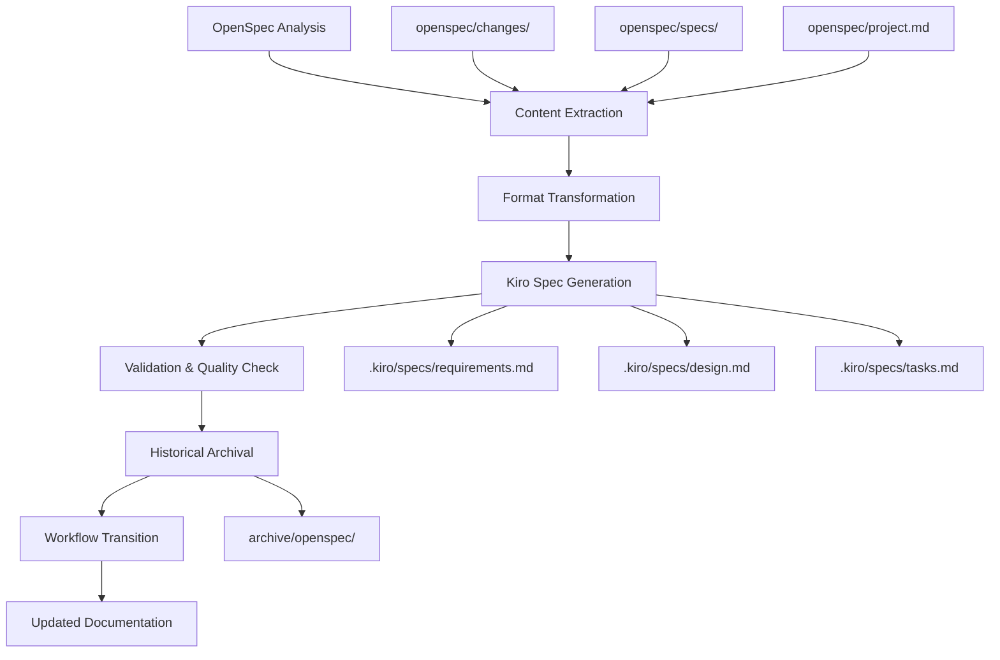

# Design Document

## Overview

This design document outlines the technical approach for migrating from OpenSpec to Kiro specifications. The migration involves analyzing existing OpenSpec content, transforming it to Kiro's format, and establishing new development workflows while preserving historical context and ensuring continuity of ongoing work.

## Architecture

### Migration Architecture



### Data Flow

1. **Analysis Phase**: Scan OpenSpec directory structure and catalog all content
2. **Extraction Phase**: Parse OpenSpec files and extract structured content
3. **Transformation Phase**: Convert OpenSpec formats to Kiro formats using mapping rules
4. **Generation Phase**: Create Kiro spec files with proper structure and validation
5. **Archival Phase**: Preserve original OpenSpec content for historical reference
6. **Transition Phase**: Update workflows and documentation for Kiro usage

## Components and Interfaces

### Migration Engine

```python
class OpenSpecToKiroMigrator:
    """Main migration orchestrator."""
    
    def __init__(self, openspec_path: Path, kiro_path: Path):
        self.openspec_path = openspec_path
        self.kiro_path = kiro_path
        self.analyzer = OpenSpecAnalyzer()
        self.transformer = ContentTransformer()
        self.generator = KiroSpecGenerator()
        self.validator = MigrationValidator()
    
    def migrate(self) -> MigrationReport:
        """Execute complete migration process."""
        # Analysis
        openspec_content = self.analyzer.analyze_openspec_structure()
        
        # Transformation
        kiro_content = self.transformer.transform_content(openspec_content)
        
        # Generation
        specs = self.generator.generate_kiro_specs(kiro_content)
        
        # Validation
        validation_report = self.validator.validate_migration(specs)
        
        return MigrationReport(specs, validation_report)
```

### Content Analysis

```python
class OpenSpecAnalyzer:
    """Analyzes existing OpenSpec content structure."""
    
    def analyze_openspec_structure(self) -> OpenSpecContent:
        """Scan and catalog all OpenSpec content."""
        return OpenSpecContent(
            active_changes=self._scan_changes(),
            specifications=self._scan_specs(),
            project_context=self._parse_project_md(),
            agent_instructions=self._parse_agents_md()
        )
    
    def _scan_changes(self) -> List[OpenSpecChange]:
        """Extract all active changes from openspec/changes/."""
        changes = []
        for change_dir in self.openspec_path.glob("changes/*/"):
            if change_dir.name != "archive":
                change = self._parse_change(change_dir)
                changes.append(change)
        return changes
    
    def _scan_specs(self) -> List[OpenSpecSpec]:
        """Extract all specifications from openspec/specs/."""
        specs = []
        for spec_dir in self.openspec_path.glob("specs/*/"):
            spec = self._parse_spec(spec_dir)
            specs.append(spec)
        return specs
```

### Content Transformation

```python
class ContentTransformer:
    """Transforms OpenSpec content to Kiro format."""
    
    def transform_content(self, openspec_content: OpenSpecContent) -> KiroContent:
        """Transform all OpenSpec content to Kiro format."""
        return KiroContent(
            specs=self._consolidate_specs(openspec_content),
            migrations=self._convert_changes_to_specs(openspec_content.active_changes)
        )
    
    def _convert_changes_to_specs(self, changes: List[OpenSpecChange]) -> List[KiroSpec]:
        """Convert OpenSpec changes to Kiro specs."""
        kiro_specs = []
        for change in changes:
            spec = KiroSpec(
                name=self._generate_spec_name(change),
                requirements=self._convert_proposal_to_requirements(change.proposal),
                design=self._convert_design(change.design) if change.design else None,
                tasks=self._convert_tasks(change.tasks)
            )
            kiro_specs.append(spec)
        return kiro_specs
    
    def _convert_proposal_to_requirements(self, proposal: OpenSpecProposal) -> KiroRequirements:
        """Convert OpenSpec proposal to Kiro requirements with EARS patterns."""
        requirements = []
        
        # Extract user stories from proposal content
        user_stories = self._extract_user_stories(proposal)
        
        # Convert to EARS patterns
        for story in user_stories:
            requirement = self._convert_to_ears_requirement(story)
            requirements.append(requirement)
        
        return KiroRequirements(
            introduction=self._generate_introduction(proposal),
            glossary=self._extract_glossary_terms(proposal),
            requirements=requirements
        )
```

### Kiro Spec Generation

```python
class KiroSpecGenerator:
    """Generates Kiro specification files."""
    
    def generate_kiro_specs(self, kiro_content: KiroContent) -> List[GeneratedSpec]:
        """Generate all Kiro spec files."""
        generated_specs = []
        
        for spec in kiro_content.specs:
            spec_dir = self.kiro_path / "specs" / spec.name
            spec_dir.mkdir(parents=True, exist_ok=True)
            
            # Generate requirements.md
            requirements_file = spec_dir / "requirements.md"
            self._write_requirements_file(requirements_file, spec.requirements)
            
            # Generate design.md if present
            if spec.design:
                design_file = spec_dir / "design.md"
                self._write_design_file(design_file, spec.design)
            
            # Generate tasks.md
            tasks_file = spec_dir / "tasks.md"
            self._write_tasks_file(tasks_file, spec.tasks)
            
            generated_specs.append(GeneratedSpec(spec.name, spec_dir))
        
        return generated_specs
    
    def _write_requirements_file(self, file_path: Path, requirements: KiroRequirements):
        """Write requirements.md in proper Kiro format."""
        content = f"""# Requirements Document

## Introduction

{requirements.introduction}

## Glossary

{self._format_glossary(requirements.glossary)}

## Requirements

{self._format_requirements(requirements.requirements)}
"""
        file_path.write_text(content)
```

## Data Models

### OpenSpec Content Models

```python
@dataclass
class OpenSpecChange:
    """Represents an OpenSpec change proposal."""
    id: str
    proposal: OpenSpecProposal
    tasks: OpenSpecTasks
    design: Optional[OpenSpecDesign]
    spec_deltas: List[OpenSpecDelta]

@dataclass
class OpenSpecProposal:
    """OpenSpec proposal.md content."""
    why: str
    what_changes: List[str]
    impact: OpenSpecImpact

@dataclass
class OpenSpecTasks:
    """OpenSpec tasks.md content."""
    tasks: List[OpenSpecTask]

@dataclass
class OpenSpecTask:
    """Individual task from OpenSpec."""
    id: str
    description: str
    completed: bool
    subtasks: List[str]
```

### Kiro Content Models

```python
@dataclass
class KiroSpec:
    """Represents a complete Kiro specification."""
    name: str
    requirements: KiroRequirements
    design: Optional[KiroDesign]
    tasks: KiroTasks

@dataclass
class KiroRequirements:
    """Kiro requirements.md content."""
    introduction: str
    glossary: Dict[str, str]
    requirements: List[KiroRequirement]

@dataclass
class KiroRequirement:
    """Individual requirement in EARS format."""
    number: int
    user_story: str
    acceptance_criteria: List[str]

@dataclass
class KiroTasks:
    """Kiro tasks.md content."""
    tasks: List[KiroTask]

@dataclass
class KiroTask:
    """Individual task for Kiro execution."""
    number: str
    description: str
    subtasks: List[str]
    requirements_refs: List[str]
```

## Error Handling

### Migration Error Types

```python
class MigrationError(Exception):
    """Base exception for migration errors."""
    pass

class ContentParsingError(MigrationError):
    """Error parsing OpenSpec content."""
    pass

class TransformationError(MigrationError):
    """Error transforming content to Kiro format."""
    pass

class ValidationError(MigrationError):
    """Error validating migrated content."""
    pass

class FileSystemError(MigrationError):
    """Error with file operations during migration."""
    pass
```

### Error Recovery

```python
class MigrationErrorHandler:
    """Handles migration errors with recovery strategies."""
    
    def handle_parsing_error(self, error: ContentParsingError, file_path: Path):
        """Handle content parsing errors."""
        logger.error(f"Failed to parse {file_path}: {error}")
        
        # Attempt manual parsing with relaxed rules
        try:
            return self._parse_with_fallback(file_path)
        except Exception:
            # Create placeholder content for manual review
            return self._create_placeholder_content(file_path)
    
    def handle_transformation_error(self, error: TransformationError, content: Any):
        """Handle content transformation errors."""
        logger.error(f"Failed to transform content: {error}")
        
        # Create minimal valid Kiro spec for manual completion
        return self._create_minimal_kiro_spec(content)
```

## Testing Strategy

### Migration Testing Approach

1. **Unit Tests**: Test individual transformation functions
2. **Integration Tests**: Test complete migration of sample OpenSpec content
3. **Validation Tests**: Verify migrated Kiro specs are valid and executable
4. **Regression Tests**: Ensure no content is lost during migration

### Test Data

```python
class MigrationTestData:
    """Provides test data for migration testing."""
    
    @staticmethod
    def sample_openspec_change() -> OpenSpecChange:
        """Create sample OpenSpec change for testing."""
        return OpenSpecChange(
            id="add-test-feature",
            proposal=OpenSpecProposal(
                why="Need test feature for validation",
                what_changes=["Add test component", "Update configuration"],
                impact=OpenSpecImpact(
                    affected_specs=["test-spec"],
                    affected_code=["src/test/"]
                )
            ),
            tasks=OpenSpecTasks(tasks=[
                OpenSpecTask(
                    id="1.1",
                    description="Implement test component",
                    completed=False,
                    subtasks=["Create test class", "Add test methods"]
                )
            ]),
            design=None,
            spec_deltas=[]
        )
    
    @staticmethod
    def expected_kiro_spec() -> KiroSpec:
        """Expected Kiro spec from sample OpenSpec change."""
        return KiroSpec(
            name="test-feature-implementation",
            requirements=KiroRequirements(
                introduction="Implementation of test feature for validation purposes.",
                glossary={"Test_Component": "Component for testing functionality"},
                requirements=[
                    KiroRequirement(
                        number=1,
                        user_story="As a developer, I want a test feature, so that I can validate functionality.",
                        acceptance_criteria=[
                            "THE Test_Component SHALL provide test functionality",
                            "THE Test_Component SHALL integrate with existing configuration"
                        ]
                    )
                ]
            ),
            design=None,
            tasks=KiroTasks(tasks=[
                KiroTask(
                    number="1.1",
                    description="Implement test component",
                    subtasks=["Create test class", "Add test methods"],
                    requirements_refs=["1.1"]
                )
            ])
        )
```

## Migration Mapping Rules

### OpenSpec to Kiro Mapping

| OpenSpec Element | Kiro Element | Transformation Rule |
|------------------|--------------|-------------------|
| `proposal.md` → `why` | `requirements.md` → `introduction` | Extract problem statement and context |
| `proposal.md` → `what_changes` | `requirements.md` → `requirements` | Convert to user stories with EARS patterns |
| `tasks.md` | `tasks.md` | Preserve task structure, add requirement references |
| `design.md` | `design.md` | Direct migration with format updates |
| Spec deltas | Requirements | Convert ADDED/MODIFIED/REMOVED to requirements |

### Content Transformation Rules

1. **User Story Generation**: Extract user personas and goals from OpenSpec proposals
2. **EARS Pattern Application**: Convert requirements to "THE system SHALL" format
3. **Acceptance Criteria**: Derive from OpenSpec scenarios and validation points
4. **Task Numbering**: Maintain hierarchical task numbering from OpenSpec
5. **Requirement References**: Link tasks to specific requirements

## Validation Framework

### Migration Validation

```python
class MigrationValidator:
    """Validates migration completeness and accuracy."""
    
    def validate_migration(self, generated_specs: List[GeneratedSpec]) -> ValidationReport:
        """Comprehensive migration validation."""
        issues = []
        
        # Content completeness validation
        issues.extend(self._validate_content_completeness(generated_specs))
        
        # Format validation
        issues.extend(self._validate_kiro_format(generated_specs))
        
        # EARS pattern validation
        issues.extend(self._validate_ears_patterns(generated_specs))
        
        # Task structure validation
        issues.extend(self._validate_task_structure(generated_specs))
        
        return ValidationReport(
            total_specs=len(generated_specs),
            validation_issues=issues,
            passed=len(issues) == 0
        )
    
    def _validate_ears_patterns(self, specs: List[GeneratedSpec]) -> List[ValidationIssue]:
        """Validate that requirements follow EARS patterns."""
        issues = []
        
        for spec in specs:
            requirements = self._parse_requirements(spec)
            for req in requirements:
                if not self._is_valid_ears_pattern(req.acceptance_criteria):
                    issues.append(ValidationIssue(
                        spec=spec.name,
                        type="ears_pattern",
                        message=f"Requirement {req.number} does not follow EARS patterns"
                    ))
        
        return issues
```

## Historical Preservation

### Archive Strategy

```python
class HistoricalPreserver:
    """Preserves OpenSpec content for historical reference."""
    
    def archive_openspec(self, openspec_path: Path, archive_path: Path):
        """Archive complete OpenSpec directory structure."""
        archive_path.mkdir(parents=True, exist_ok=True)
        
        # Copy entire openspec directory
        shutil.copytree(openspec_path, archive_path / "openspec")
        
        # Create migration mapping
        self._create_migration_mapping(archive_path)
        
        # Create README for archived content
        self._create_archive_readme(archive_path)
    
    def _create_migration_mapping(self, archive_path: Path):
        """Create mapping from OpenSpec to Kiro specs."""
        mapping = {
            "migration_date": datetime.now().isoformat(),
            "openspec_to_kiro_mapping": self._build_mapping(),
            "archived_changes": self._list_archived_changes(),
            "archived_specs": self._list_archived_specs()
        }
        
        mapping_file = archive_path / "migration_mapping.json"
        mapping_file.write_text(json.dumps(mapping, indent=2))
```

## Implementation Phases

### Phase 1: Analysis and Setup (Week 1)
- Implement OpenSpec content analysis
- Set up migration framework
- Create test data and validation framework

### Phase 2: Content Transformation (Week 2)
- Implement content transformation logic
- Convert OpenSpec changes to Kiro specs
- Handle edge cases and error conditions

### Phase 3: Validation and Quality (Week 3)
- Implement comprehensive validation
- Test migration with real OpenSpec content
- Refine transformation rules based on results

### Phase 4: Archival and Transition (Week 4)
- Archive OpenSpec content
- Update documentation and workflows
- Complete cutover to Kiro system

## Success Metrics

- **Content Preservation**: 100% of OpenSpec content migrated or archived
- **Format Compliance**: All Kiro specs pass validation
- **EARS Compliance**: All requirements follow EARS patterns
- **Task Executability**: All migrated tasks are actionable in Kiro
- **Developer Adoption**: Smooth transition to Kiro workflows