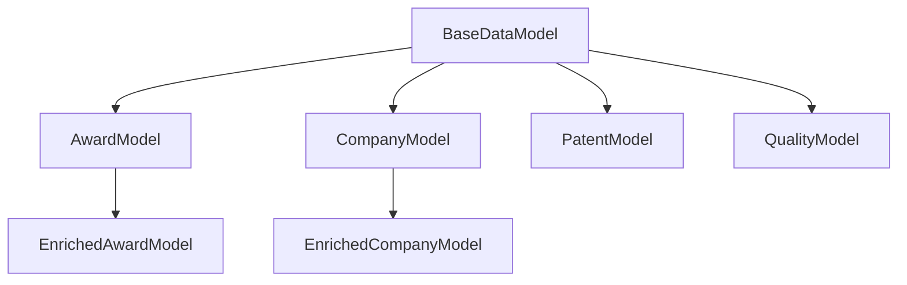

# Design Document

## Overview

This design outlines a comprehensive consolidation and refactoring strategy for the SBIR ETL pipeline codebase. The approach focuses on reducing complexity, eliminating duplication, and establishing consistent architectural patterns while maintaining all existing functionality. The design emphasizes incremental migration paths to minimize disruption to ongoing development.

## Architecture

### Current State Analysis

The current codebase exhibits several patterns that indicate organic growth:
- **Asset Proliferation**: 12+ asset files with overlapping responsibilities
- **Configuration Fragmentation**: Multiple configuration patterns across modules
- **Utility Duplication**: Similar functions scattered across different modules
- **Testing Inconsistency**: Different test patterns and setup approaches
- **Performance Monitoring Scatter**: Performance tracking code duplicated across assets

### Target Architecture

The consolidated architecture will follow a layered approach with clear separation of concerns:

```
src/
├── core/                    # Consolidated core functionality
│   ├── assets/             # Unified asset definitions
│   ├── config/             # Single configuration system
│   ├── models/             # Consolidated data models
│   └── monitoring/         # Unified performance monitoring
├── pipeline/               # Pipeline-specific logic
│   ├── extraction/         # Data extraction components
│   ├── enrichment/         # Data enrichment components
│   ├── transformation/     # Data transformation components
│   └── loading/            # Data loading components
├── shared/                 # Shared utilities and helpers
│   ├── database/           # Database clients and utilities
│   ├── validation/         # Validation logic
│   └── utils/              # Common utilities
└── tests/                  # Unified testing framework
    ├── fixtures/           # Shared test fixtures
    ├── helpers/            # Test utilities
    └── scenarios/          # Test scenarios
```

## Components and Interfaces

### 1. Asset Consolidation System

**Core Interface:**
```python
class ConsolidatedAsset:
    """Base class for consolidated pipeline assets."""
    
    def __init__(self, config: PipelineConfig, monitor: PerformanceMonitor):
        self.config = config
        self.monitor = monitor
    
    def execute(self, context: AssetExecutionContext) -> AssetMaterialization:
        """Execute asset with unified monitoring and error handling."""
        pass
```

**Asset Groups:**
- **Ingestion Assets**: Consolidate raw_sbir_awards, usaspending_extraction, uspto_extraction
- **Validation Assets**: Merge validation logic across all data sources
- **Enrichment Assets**: Unify company_enrichment, usaspending_enrichment
- **Transformation Assets**: Consolidate graph preparation and data transformation
- **Loading Assets**: Merge Neo4j loading assets with consistent patterns

### 2. Unified Configuration System

**Configuration Hierarchy:**
```python
class CoreConfig(BaseModel):
    """Core configuration shared across all components."""
    environment: str
    debug: bool
    log_level: str

class DatabaseConfig(BaseModel):
    """Unified database configuration."""
    neo4j: Neo4jConfig
    duckdb: DuckDBConfig

class PipelineConfig(BaseModel):
    """Root configuration with all subsystems."""
    core: CoreConfig
    databases: DatabaseConfig
    data_quality: DataQualityConfig
    performance: PerformanceConfig
```

**Configuration Loading Strategy:**
- Single configuration loader with environment-specific overrides
- Type-safe validation with clear error messages
- Consistent environment variable naming (SBIR_ETL__ prefix)
- Hot-reload capability for development environments### 3. Unifi
ed Testing Framework

**Test Infrastructure:**
```python
class PipelineTestCase:
    """Base test case with common setup and utilities."""
    
    @pytest.fixture
    def pipeline_config(self) -> PipelineConfig:
        """Provide test configuration."""
        pass
    
    @pytest.fixture
    def mock_databases(self) -> DatabaseMocks:
        """Provide mocked database connections."""
        pass
    
    @pytest.fixture
    def test_data_manager(self) -> TestDataManager:
        """Provide test data management."""
        pass
```

**Test Categories:**
- **Unit Tests**: Component-level testing with mocked dependencies
- **Integration Tests**: Multi-component testing with real databases
- **E2E Tests**: Full pipeline testing with containerized environment
- **Performance Tests**: Resource usage and timing validation

### 4. Performance Monitoring System

**Monitoring Architecture:**
```python
class UnifiedPerformanceMonitor:
    """Centralized performance monitoring for all pipeline components."""
    
    def track_asset_execution(self, asset_name: str) -> ContextManager:
        """Track asset execution with memory and timing."""
        pass
    
    def track_database_operation(self, operation: str) -> ContextManager:
        """Track database operations."""
        pass
    
    def generate_performance_report(self) -> PerformanceReport:
        """Generate comprehensive performance report."""
        pass
```

**Monitoring Features:**
- Automatic memory usage tracking
- Database operation timing
- Asset execution metrics
- Resource utilization alerts
- Performance regression detection

### 5. Data Model Consolidation

**Model Hierarchy:**
```python
class BaseDataModel(BaseModel):
    """Base model with common validation and serialization."""
    
    class Config:
        validate_assignment = True
        str_strip_whitespace = True
        json_encoders = {date: lambda v: v.isoformat()}

class AwardModel(BaseDataModel):
    """Consolidated award model for SBIR/STTR awards."""
    pass

class CompanyModel(BaseDataModel):
    """Consolidated company model with enrichment fields."""
    pass

class PatentModel(BaseDataModel):
    """Consolidated patent model with relationships."""
    pass
```

## Data Models

### Consolidated Model Structure

**Core Models:**
- `BaseDataModel`: Common validation and serialization patterns
- `AwardModel`: Unified SBIR/STTR award representation
- `CompanyModel`: Company data with enrichment capabilities
- `PatentModel`: Patent data with relationship tracking
- `QualityModel`: Data quality metrics and validation results

**Model Relationships:**


**Validation Strategy:**
- Shared validators for common patterns (UEI, DUNS, dates)
- Hierarchical validation with clear error reporting
- Performance-optimized validation for large datasets
- Configurable validation strictness levels

## Error Handling

### Unified Error Handling Strategy

**Error Categories:**
- `ConfigurationError`: Configuration validation and loading errors
- `DataValidationError`: Data quality and schema validation errors
- `DatabaseError`: Database connection and operation errors
- `EnrichmentError`: External API and enrichment service errors
- `PerformanceError`: Resource usage and timeout errors

**Error Handling Patterns:**
```python
class PipelineErrorHandler:
    """Centralized error handling for pipeline operations."""
    
    def handle_validation_error(self, error: DataValidationError) -> ErrorResponse:
        """Handle data validation errors with recovery options."""
        pass
    
    def handle_database_error(self, error: DatabaseError) -> ErrorResponse:
        """Handle database errors with retry logic."""
        pass
    
    def handle_enrichment_error(self, error: EnrichmentError) -> ErrorResponse:
        """Handle enrichment errors with fallback strategies."""
        pass
```

**Recovery Strategies:**
- Automatic retry with exponential backoff
- Graceful degradation for non-critical failures
- Circuit breaker pattern for external services
- Comprehensive error logging and alerting#
# Testing Strategy

### Unified Testing Approach

**Test Infrastructure Consolidation:**
- Single test configuration system across all test types
- Shared test fixtures and utilities
- Consistent mocking patterns for external dependencies
- Unified test data management with realistic datasets

**Test Categories and Patterns:**

1. **Unit Tests**
   - Component isolation with dependency injection
   - Shared mock factories for common dependencies
   - Performance-focused test execution
   - Consistent assertion patterns

2. **Integration Tests**
   - Real database connections with test isolation
   - Shared database setup and teardown utilities
   - Cross-component interaction validation
   - Data flow verification

3. **E2E Tests**
   - Containerized test environment with resource optimization
   - Scenario-based testing (minimal, standard, large, edge-cases)
   - Performance validation within MacBook Air constraints
   - Comprehensive pipeline validation

**Test Data Strategy:**
```python
class TestDataManager:
    """Centralized test data management."""
    
    def get_sample_awards(self, size: str = "small") -> List[SbirAward]:
        """Get sample SBIR awards for testing."""
        pass
    
    def get_mock_usaspending_data(self) -> DataFrame:
        """Get mock USAspending data for enrichment testing."""
        pass
    
    def setup_test_neo4j(self) -> Neo4jTestClient:
        """Setup isolated Neo4j instance for testing."""
        pass
```

### Performance Testing Framework

**Resource Monitoring:**
- Memory usage tracking with MacBook Air optimization
- Execution time validation with performance baselines
- Database operation efficiency measurement
- Resource leak detection

**Performance Baselines:**
- Asset execution time thresholds
- Memory usage limits per pipeline stage
- Database operation performance targets
- Overall pipeline completion time goals

## Migration Strategy

### Incremental Migration Approach

**Phase 1: Foundation (Weeks 1-2)**
- Establish unified configuration system
- Create consolidated performance monitoring
- Set up unified testing framework
- Implement error handling infrastructure

**Phase 2: Asset Consolidation (Weeks 3-4)**
- Merge similar assets with backward compatibility
- Consolidate asset execution patterns
- Unify asset metadata and monitoring
- Update asset dependencies and relationships

**Phase 3: Model and Utility Consolidation (Weeks 5-6)**
- Merge duplicate data models
- Consolidate utility functions
- Unify validation logic
- Streamline database clients

**Phase 4: Testing and Documentation (Weeks 7-8)**
- Migrate all tests to unified framework
- Update documentation and developer guides
- Performance optimization and validation
- Final cleanup and code quality enforcement

### Backward Compatibility Strategy

**Compatibility Layers:**
- Wrapper functions for deprecated APIs
- Configuration migration utilities
- Asset name aliasing during transition
- Gradual deprecation warnings

**Migration Tools:**
```python
class MigrationHelper:
    """Tools to assist with codebase migration."""
    
    def migrate_asset_config(self, old_config: dict) -> PipelineConfig:
        """Migrate old configuration to new format."""
        pass
    
    def validate_migration(self, component: str) -> MigrationReport:
        """Validate successful migration of component."""
        pass
```

## Quality Assurance

### Code Quality Enforcement

**Automated Quality Gates:**
- Architectural compliance validation
- Duplicate code detection and prevention
- Import organization and dependency management
- Performance regression detection

**Quality Metrics:**
- Code duplication reduction targets (30-60% reduction)
- Test coverage maintenance (≥85%)
- Performance benchmark compliance
- Documentation completeness validation

**Continuous Integration Enhancements:**
```yaml
quality_gates:
  - architectural_compliance_check
  - duplicate_code_detection
  - performance_regression_test
  - migration_validation
  - documentation_completeness
```

### Documentation Strategy

**Consolidated Documentation:**
- Single developer guide with clear architectural overview
- Migration guides for legacy pattern updates
- API documentation with usage examples
- Performance tuning and optimization guides

**Documentation Structure:**
```
docs/
├── architecture/
│   ├── consolidated-design.md
│   ├── migration-guide.md
│   └── performance-optimization.md
├── development/
│   ├── setup-guide.md
│   ├── testing-guide.md
│   └── contribution-guidelines.md
└── api/
    ├── configuration-reference.md
    ├── asset-reference.md
    └── utility-reference.md
```

This design provides a comprehensive roadmap for consolidating and refactoring the SBIR ETL pipeline codebase while maintaining functionality and enabling future development efficiency.