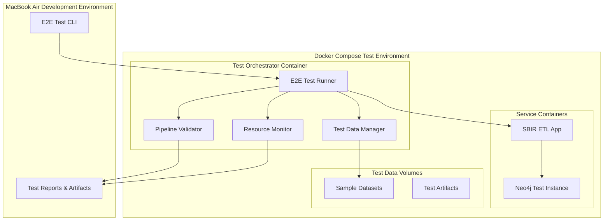

# E2E Testing Enhancement Design Document

## Overview

This design document outlines the architecture and implementation approach for enhancing the SBIR ETL pipeline's end-to-end testing capabilities. The solution provides a comprehensive, dockerized testing environment that can run efficiently on a MacBook Air with 8GB RAM while validating the complete pipeline from data ingestion through Neo4j graph creation within a 10-minute execution window.

The design builds upon the existing test infrastructure in `tests/e2e/` and `docker/docker-compose.test.yml` while adding robust E2E capabilities, resource monitoring, and comprehensive validation across all five ETL pipeline stages (Extract, Validate, Enrich, Transform, Load).

## Architecture

### High-Level Architecture



### Component Architecture

#### 1. E2E Test CLI

- **Purpose**: Single entry point for running E2E tests with scenario selection
- **Location**: `scripts/run_e2e_tests.py` (enhances existing `scripts/run_e2e_tests.py`)
- **Responsibilities**:
  - Parse command-line arguments for test scenarios (minimal, standard, large, edge-cases)
  - Orchestrate Docker Compose environment startup/teardown
  - Aggregate and display test results with timing and resource metrics
  - Handle cleanup on interruption and preserve artifacts for failed tests
  - Integrate with existing `make docker-test` workflow

#### 2. Dockerized Test Environment

- **Purpose**: Isolated, reproducible test environment optimized for MacBook Air
- **Configuration**: Enhances existing `docker/docker-compose.test.yml` with E2E-specific optimizations
- **Components**:
  - Test orchestrator container (extends existing test container)
  - Neo4j test instance (1GB heap limit, ephemeral)
  - SBIR ETL application container (existing)
  - Shared volumes for test data and artifacts
- **Resource Constraints**: 8GB total memory limit, 2-minute startup timeout

#### 3. Test Data Manager

- **Purpose**: Manage test datasets and data lifecycle
- **Location**: `tests/e2e/data_manager.py`
- **Responsibilities**:
  - Provide curated test datasets (SBIR, USAspending, USPTO samples)
  - Generate synthetic data for edge case testing
  - Clean up test artifacts between runs
  - Validate data isolation

#### 4. Pipeline Validator

- **Purpose**: Comprehensive validation of pipeline outputs
- **Location**: `tests/e2e/pipeline_validator.py`
- **Responsibilities**:
  - Validate data flow through all ETL stages
  - Check Neo4j graph structure and relationships
  - Verify performance metrics and thresholds
  - Generate detailed validation reports

#### 5. Resource Monitor

- **Purpose**: Track resource usage during testing
- **Location**: `tests/e2e/resource_monitor.py`
- **Responsibilities**:
  - Monitor memory and CPU usage
  - Ensure MacBook Air compatibility
  - Alert on resource threshold violations
  - Include resource metrics in test reports

## Components and Interfaces

### Test Data Manager Interface

```python
class TestDataManager:
    def setup_test_data(self, scenario: TestScenario) -> TestDataPaths
    def cleanup_test_data(self) -> None
    def validate_data_isolation(self) -> bool
    def get_sample_datasets(self) -> Dict[str, Path]
```

### Test Scenarios

- `MINIMAL`: Small datasets (100 SBIR, 500 USAspending records) for quick validation under 2 minutes
- `STANDARD`: Representative datasets (1,000 SBIR, 5,000 USAspending records) for full testing within 5-8 minutes
- `LARGE`: Larger datasets (10,000 SBIR, 50,000 USAspending records) for performance testing within 8-10 minutes
- `EDGE_CASES`: Datasets with missing fields, invalid formats, and error conditions for robustness testing within 3-5 minutes

### Pipeline Validator Interface

```python
class PipelineValidator:
    def validate_extraction_stage(self, outputs: Dict) -> ValidationResult
    def validate_enrichment_stage(self, outputs: Dict) -> ValidationResult
    def validate_neo4j_graph(self, neo4j_client: Neo4jClient) -> ValidationResult
    def generate_validation_report(self) -> TestReport
```

### Validation Checks

- Record count validation at each stage
- Schema compliance verification
- Data quality metrics validation
- Neo4j graph structure verification
- Performance threshold validation

### Resource Monitor Interface

```python
class ResourceMonitor:
    def start_monitoring(self) -> None
    def stop_monitoring(self) -> ResourceMetrics
    def check_memory_threshold(self, threshold_gb: float) -> bool
    def get_performance_summary(self) -> Dict[str, Any]
```

## Data Models

### Test Configuration Model

```python
@dataclass
class E2ETestConfig:
    scenario: TestScenario
    timeout_minutes: int = 10
    memory_limit_gb: float = 8.0
    cleanup_on_failure: bool = True
    generate_artifacts: bool = True
    stages_to_test: List[PipelineStage] = field(default_factory=lambda: list(PipelineStage))
```

### Test Result Models

```python
@dataclass
class StageResult:
    stage: PipelineStage
    success: bool
    duration_seconds: float
    record_count: int
    validation_results: List[ValidationCheck]
    errors: List[str]

@dataclass
class E2ETestResult:
    overall_success: bool
    total_duration_seconds: float
    stage_results: List[StageResult]
    resource_metrics: ResourceMetrics
    artifacts_path: Path
```

## Error Handling

### Error Categories

1. **Environment Setup Errors**
   - Docker service startup failures
   - Network connectivity issues
   - Volume mounting problems

2. **Pipeline Execution Errors**
   - Data processing failures
   - Database connection issues
   - Memory/resource exhaustion

3. **Validation Errors**
   - Schema validation failures
   - Data quality threshold violations
   - Graph structure inconsistencies

### Error Recovery Strategies

- **Retry Logic**: Automatic retry for transient failures (network, service startup)
- **Graceful Degradation**: Continue with partial testing when non-critical components fail
- **Resource Management**: Automatic cleanup and resource release on failures
- **Detailed Logging**: Comprehensive error logging with context for debugging

## Testing Strategy

### Test Scenarios

#### 1. Smoke Test (MINIMAL scenario)

- **Duration**: < 2 minutes
- **Data**: 100 SBIR records, 500 USAspending records
- **Validation**: Basic pipeline execution, minimal graph validation
- **Use Case**: Quick validation during development

#### 2. Standard E2E Test (STANDARD scenario)

- **Duration**: 5-8 minutes
- **Data**: 1,000 SBIR records, 5,000 USAspending records, sample USPTO data
- **Validation**: Full pipeline validation, comprehensive graph checks
- **Use Case**: Pre-commit validation, CI/CD integration

#### 3. Performance Test (LARGE scenario)

- **Duration**: 8-10 minutes
- **Data**: 10,000 SBIR records, 50,000 USAspending records
- **Validation**: Performance metrics, resource usage validation
- **Use Case**: Performance regression testing

#### 4. Edge Case Test (EDGE_CASES scenario)

- **Duration**: 3-5 minutes
- **Data**: Datasets with missing fields, invalid formats, edge cases
- **Validation**: Error handling, data quality validation
- **Use Case**: Robustness testing

### Validation Checkpoints

1. **Data Extraction Validation**
   - File reading success
   - Record count verification
   - Schema compliance

2. **Data Enrichment Validation**
   - Match rate thresholds (>= 70% minimum requirement)
   - Enrichment quality metrics and confidence scoring
   - Performance benchmarks and API response times

3. **Neo4j Loading Validation**
   - Node creation verification
   - Relationship establishment
   - Graph query validation

4. **End-to-End Validation**
   - Complete data flow verification
   - Performance metrics validation
   - Resource usage compliance

## Implementation Phases

### Phase 1: Core Infrastructure

- Docker Compose configuration for E2E testing
- Basic test orchestrator and CLI
- Test data manager with sample datasets
- Resource monitoring foundation

### Phase 2: Pipeline Validation

- Comprehensive pipeline validator
- Stage-specific validation logic
- Neo4j graph validation
- Test reporting infrastructure

### Phase 3: Advanced Features

- Multiple test scenarios
- Performance benchmarking
- Detailed error diagnostics
- Integration with existing CI/CD

### Phase 4: Optimization

- Resource usage optimization for MacBook Air
- Test execution time optimization
- Enhanced reporting and visualization
- Documentation and developer guides

## Docker Compose Configuration

### Service Definitions

The E2E testing environment extends the existing `docker/docker-compose.test.yml` configuration with MacBook Air optimizations:

```yaml

## Enhancement to existing docker/docker-compose.test.yml

services:
  app:
    # Existing service with E2E test scenario support
    environment:

      - E2E_TEST_SCENARIO=${E2E_TEST_SCENARIO:-standard}
      - SBIR_ETL__PIPELINE__CHUNK_SIZE=1000  # Reduced for memory efficiency

    mem_limit: 4g  # MacBook Air memory constraint

  neo4j:
    # Existing Neo4j service with E2E optimizations
    environment:

      - NEO4J_dbms_memory_heap_initial__size=512m
      - NEO4J_dbms_memory_heap_max__size=1g
      - NEO4J_dbms_memory_pagecache_size=256m

    mem_limit: 2g  # MacBook Air memory constraint
    healthcheck:
      test: ["CMD-SHELL", "cypher-shell -u neo4j -p ${NEO4J_PASSWORD} 'RETURN 1'"]
      interval: 10s
      timeout: 5s
      retries: 12
      start_period: 30s

  # New E2E-specific volumes for test artifacts
volumes:
  e2e-test-artifacts:
    driver: local
```

## Integration with Existing Infrastructure

### Leveraging Current Test Framework

The E2E testing enhancement builds upon existing infrastructure:

1. **Existing Test Structure**
   - Extends `tests/e2e/test_dagster_enrichment_pipeline.py` with scenario-based testing
   - Utilizes existing `tests/fixtures/` for sample data
   - Integrates with current `conftest.py` and pytest configuration

2. **Docker Infrastructure**
   - Enhances existing `docker/docker-compose.test.yml` rather than creating new compose files
   - Leverages existing `make docker-test` workflow with scenario selection
   - Uses existing container images with E2E-specific environment variables

3. **Performance Monitoring**
   - Integrates with existing `src/utils/performance_monitor.py` infrastructure
   - Utilizes current `src/utils/metrics.py` for resource tracking
   - Extends existing performance baseline and alerting systems

4. **Dagster Integration**
   - Works with existing Dagster asset definitions in `src/assets/`
   - Leverages current asset execution and materialization patterns
   - Integrates with existing asset checks and quality gates

### Configuration Integration

The E2E testing system integrates with the existing configuration framework:

```python

## Extends existing config/base.yaml

e2e_testing:
  scenarios:
    minimal:
      timeout_minutes: 2
      memory_limit_gb: 6.0
      dataset_sizes:
        sbir_records: 100
        usaspending_records: 500
    standard:
      timeout_minutes: 8
      memory_limit_gb: 8.0
      dataset_sizes:
        sbir_records: 1000
        usaspending_records: 5000

  resource_monitoring:
    memory_warning_threshold_gb: 6.0
    memory_critical_threshold_gb: 7.5
    cpu_warning_threshold_percent: 80.0
```

## Performance Considerations

### MacBook Air Optimization

1. **Memory Management**
   - Limit Neo4j heap size to 1GB maximum (512MB initial, 1GB max)
   - Neo4j pagecache limited to 256MB
   - Application container limited to 4GB
   - Total system memory usage monitored to stay below 8GB
   - Use streaming data processing and chunked operations
   - Implement garbage collection monitoring and alerts

2. **CPU Optimization**
   - Parallel processing limited to 2-4 threads maximum
   - Efficient data structures and algorithms optimized for memory
   - Minimize container resource overhead with optimized base images
   - Use existing performance monitoring infrastructure

3. **Storage Optimization**
   - Use Docker volumes for persistent test data and artifacts
   - Implement efficient cleanup strategies with automatic artifact removal
   - Compress test artifacts when possible to save disk space
   - Leverage existing test fixtures and data management patterns

4. **Startup Optimization**
   - 2-minute maximum startup time for all services
   - Health checks optimized for quick service readiness detection
   - Parallel service startup where possible

### Scalability Considerations

- Modular test scenarios for different resource constraints
- Configurable timeout and resource limits
- Support for running subset of tests based on available resources
