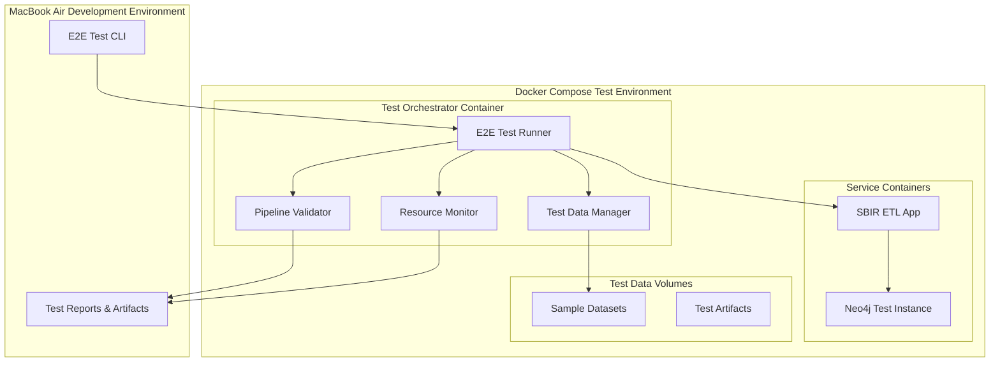

# E2E Testing Enhancement Design Document

## Overview

This design document outlines the architecture and implementation approach for enhancing the SBIR ETL pipeline's end-to-end testing capabilities. The solution provides a comprehensive, dockerized testing environment that can run efficiently on a MacBook Air while validating the complete pipeline from data ingestion through Neo4j graph creation.

The design builds upon the existing test infrastructure while adding robust E2E capabilities, resource monitoring, and comprehensive validation across all pipeline stages.

## Architecture

### High-Level Architecture



### Component Architecture

#### 1. E2E Test CLI
- **Purpose**: Single entry point for running E2E tests
- **Location**: `scripts/e2e_test_runner.py`
- **Responsibilities**:
  - Parse command-line arguments for test scenarios
  - Orchestrate Docker Compose environment startup/teardown
  - Aggregate and display test results
  - Handle cleanup on interruption

#### 2. Dockerized Test Environment
- **Purpose**: Isolated, reproducible test environment
- **Configuration**: `docker/docker-compose.e2e.yml`
- **Components**:
  - Test orchestrator container (Python-based)
  - Neo4j test instance (ephemeral)
  - SBIR ETL application container
  - Shared volumes for test data and artifacts

#### 3. Test Data Manager
- **Purpose**: Manage test datasets and data lifecycle
- **Location**: `tests/e2e/data_manager.py`
- **Responsibilities**:
  - Provide curated test datasets (SBIR, USAspending, USPTO samples)
  - Generate synthetic data for edge case testing
  - Clean up test artifacts between runs
  - Validate data isolation

#### 4. Pipeline Validator
- **Purpose**: Comprehensive validation of pipeline outputs
- **Location**: `tests/e2e/pipeline_validator.py`
- **Responsibilities**:
  - Validate data flow through all ETL stages
  - Check Neo4j graph structure and relationships
  - Verify performance metrics and thresholds
  - Generate detailed validation reports

#### 5. Resource Monitor
- **Purpose**: Track resource usage during testing
- **Location**: `tests/e2e/resource_monitor.py`
- **Responsibilities**:
  - Monitor memory and CPU usage
  - Ensure MacBook Air compatibility
  - Alert on resource threshold violations
  - Include resource metrics in test reports

## Components and Interfaces

### Test Data Manager Interface

```python
class TestDataManager:
    def setup_test_data(self, scenario: TestScenario) -> TestDataPaths
    def cleanup_test_data(self) -> None
    def validate_data_isolation(self) -> bool
    def get_sample_datasets(self) -> Dict[str, Path]
```

**Test Scenarios**:
- `MINIMAL`: Small datasets for quick validation
- `STANDARD`: Representative datasets for full testing
- `LARGE`: Larger datasets for performance testing
- `EDGE_CASES`: Datasets with edge cases and error conditions

### Pipeline Validator Interface

```python
class PipelineValidator:
    def validate_extraction_stage(self, outputs: Dict) -> ValidationResult
    def validate_enrichment_stage(self, outputs: Dict) -> ValidationResult
    def validate_neo4j_graph(self, neo4j_client: Neo4jClient) -> ValidationResult
    def generate_validation_report(self) -> TestReport
```

**Validation Checks**:
- Record count validation at each stage
- Schema compliance verification
- Data quality metrics validation
- Neo4j graph structure verification
- Performance threshold validation

### Resource Monitor Interface

```python
class ResourceMonitor:
    def start_monitoring(self) -> None
    def stop_monitoring(self) -> ResourceMetrics
    def check_memory_threshold(self, threshold_gb: float) -> bool
    def get_performance_summary(self) -> Dict[str, Any]
```

## Data Models

### Test Configuration Model

```python
@dataclass
class E2ETestConfig:
    scenario: TestScenario
    timeout_minutes: int = 10
    memory_limit_gb: float = 8.0
    cleanup_on_failure: bool = True
    generate_artifacts: bool = True
    stages_to_test: List[PipelineStage] = field(default_factory=lambda: list(PipelineStage))
```

### Test Result Models

```python
@dataclass
class StageResult:
    stage: PipelineStage
    success: bool
    duration_seconds: float
    record_count: int
    validation_results: List[ValidationCheck]
    errors: List[str]

@dataclass
class E2ETestResult:
    overall_success: bool
    total_duration_seconds: float
    stage_results: List[StageResult]
    resource_metrics: ResourceMetrics
    artifacts_path: Path
```

## Error Handling

### Error Categories

1. **Environment Setup Errors**
   - Docker service startup failures
   - Network connectivity issues
   - Volume mounting problems

2. **Pipeline Execution Errors**
   - Data processing failures
   - Database connection issues
   - Memory/resource exhaustion

3. **Validation Errors**
   - Schema validation failures
   - Data quality threshold violations
   - Graph structure inconsistencies

### Error Recovery Strategies

- **Retry Logic**: Automatic retry for transient failures (network, service startup)
- **Graceful Degradation**: Continue with partial testing when non-critical components fail
- **Resource Management**: Automatic cleanup and resource release on failures
- **Detailed Logging**: Comprehensive error logging with context for debugging

## Testing Strategy

### Test Scenarios

#### 1. Smoke Test (MINIMAL scenario)
- **Duration**: < 2 minutes
- **Data**: 100 SBIR records, 500 USAspending records
- **Validation**: Basic pipeline execution, minimal graph validation
- **Use Case**: Quick validation during development

#### 2. Standard E2E Test (STANDARD scenario)
- **Duration**: 5-8 minutes
- **Data**: 1,000 SBIR records, 5,000 USAspending records, sample USPTO data
- **Validation**: Full pipeline validation, comprehensive graph checks
- **Use Case**: Pre-commit validation, CI/CD integration

#### 3. Performance Test (LARGE scenario)
- **Duration**: 8-10 minutes
- **Data**: 10,000 SBIR records, 50,000 USAspending records
- **Validation**: Performance metrics, resource usage validation
- **Use Case**: Performance regression testing

#### 4. Edge Case Test (EDGE_CASES scenario)
- **Duration**: 3-5 minutes
- **Data**: Datasets with missing fields, invalid formats, edge cases
- **Validation**: Error handling, data quality validation
- **Use Case**: Robustness testing

### Validation Checkpoints

1. **Data Extraction Validation**
   - File reading success
   - Record count verification
   - Schema compliance

2. **Data Enrichment Validation**
   - Match rate thresholds (>= 70%)
   - Enrichment quality metrics
   - Performance benchmarks

3. **Neo4j Loading Validation**
   - Node creation verification
   - Relationship establishment
   - Graph query validation

4. **End-to-End Validation**
   - Complete data flow verification
   - Performance metrics validation
   - Resource usage compliance

## Implementation Phases

### Phase 1: Core Infrastructure
- Docker Compose configuration for E2E testing
- Basic test orchestrator and CLI
- Test data manager with sample datasets
- Resource monitoring foundation

### Phase 2: Pipeline Validation
- Comprehensive pipeline validator
- Stage-specific validation logic
- Neo4j graph validation
- Test reporting infrastructure

### Phase 3: Advanced Features
- Multiple test scenarios
- Performance benchmarking
- Detailed error diagnostics
- Integration with existing CI/CD

### Phase 4: Optimization
- Resource usage optimization for MacBook Air
- Test execution time optimization
- Enhanced reporting and visualization
- Documentation and developer guides

## Docker Compose Configuration

### Service Definitions

```yaml
# docker/docker-compose.e2e.yml
services:
  e2e-orchestrator:
    build:
      context: .
      dockerfile: docker/Dockerfile.e2e
    environment:
      - ENVIRONMENT=e2e-test
      - NEO4J_URI=bolt://neo4j-e2e:7687
    depends_on:
      neo4j-e2e:
        condition: service_healthy
    volumes:
      - ./tests/fixtures:/app/test-data:ro
      - e2e-artifacts:/app/artifacts
    networks:
      - e2e-network

  neo4j-e2e:
    image: neo4j:5.20.0
    environment:
      - NEO4J_AUTH=neo4j/e2e-password
      - NEO4J_PLUGINS=["apoc"]
    volumes:
      - e2e-neo4j-data:/data
    networks:
      - e2e-network
    healthcheck:
      test: ["CMD-SHELL", "cypher-shell -u neo4j -p e2e-password 'RETURN 1'"]
      interval: 10s
      timeout: 5s
      retries: 12

volumes:
  e2e-neo4j-data:
  e2e-artifacts:

networks:
  e2e-network:
    driver: bridge
```

## Performance Considerations

### MacBook Air Optimization

1. **Memory Management**
   - Limit Neo4j heap size to 1GB
   - Use streaming data processing where possible
   - Implement garbage collection monitoring

2. **CPU Optimization**
   - Parallel processing with thread limits
   - Efficient data structures and algorithms
   - Minimize container resource overhead

3. **Storage Optimization**
   - Use Docker volumes for persistent data
   - Implement efficient cleanup strategies
   - Compress test artifacts when possible

### Scalability Considerations

- Modular test scenarios for different resource constraints
- Configurable timeout and resource limits
- Support for running subset of tests based on available resources