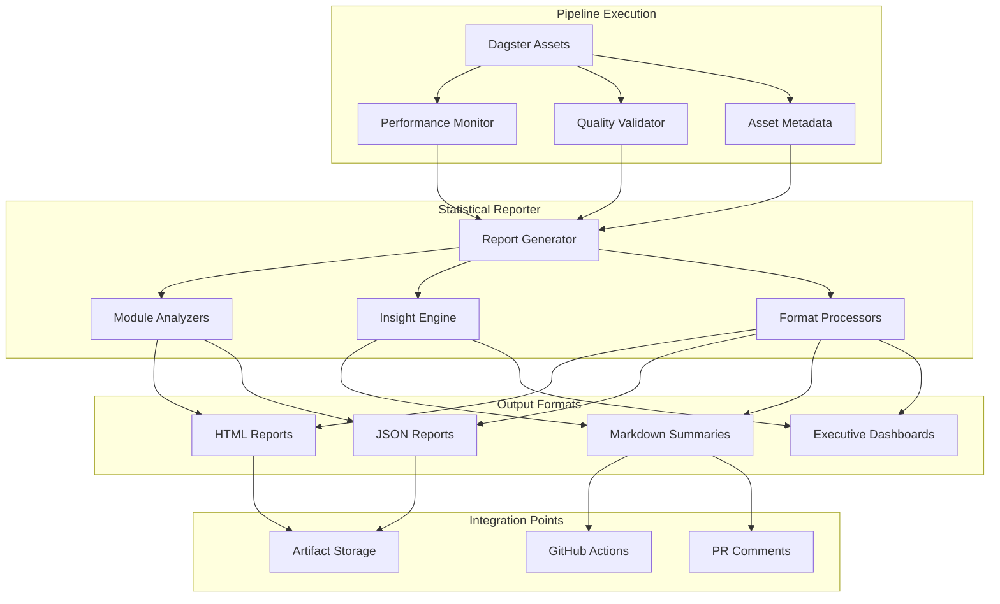

# Design Document

## Overview

The Statistical Reporting system provides comprehensive impact reporting for SBIR ETL pipeline runs, similar to the annual impact reports published by SBIR.gov. The system generates multi-format reports (HTML, JSON, Markdown) that demonstrate pipeline value, track data quality, and provide actionable insights for stakeholders ranging from developers to program managers.

The design leverages existing pipeline infrastructure including Dagster assets, performance monitoring utilities, and quality validation frameworks to create a unified reporting system that integrates seamlessly with CI/CD workflows.

## Architecture

### High-Level Architecture



### Component Integration

The Statistical Reporter integrates with existing system components:

- **Dagster Assets**: Collects execution metadata and performance metrics
- **Performance Monitor**: Leverages existing `src/utils/performance_*.py` infrastructure
- **Quality Validator**: Uses existing `src/utils/quality_*.py` frameworks
- **Configuration System**: Extends existing YAML configuration patterns
- **CI/CD Workflows**: Integrates with existing GitHub Actions workflows

## Components and Interfaces

### Core Components

#### 1. Statistical Reporter (`src/utils/statistical_reporter.py`)

**Purpose**: Main orchestrator for report generation

### Responsibilities

- Coordinate data collection from pipeline components
- Orchestrate report generation across multiple formats
- Manage report storage and artifact creation
- Handle CI/CD integration

### Interface

```python
class StatisticalReporter:
    def __init__(self, config: StatisticalReportingConfig)
    def generate_reports(self, run_context: RunContext) -> ReportCollection
    def generate_module_report(self, module: str, metrics: ModuleMetrics) -> ModuleReport
    def generate_executive_summary(self, pipeline_metrics: PipelineMetrics) -> ExecutiveSummary
```

#### 2. Module Analyzers (`src/utils/reporting/analyzers/`)

**Purpose**: Generate module-specific statistical analysis

### Components

- `SbirEnrichmentAnalyzer`: SBIR enrichment metrics and coverage analysis
- `PatentAnalysisAnalyzer`: Patent validation and loading statistics
- `CetClassificationAnalyzer`: CET classification performance metrics
- `TransitionDetectionAnalyzer`: Technology transition analysis results

### Interface

```python
class ModuleAnalyzer(ABC):
    @abstractmethod
    def analyze(self, module_data: ModuleData) -> ModuleReport
    @abstractmethod
    def get_key_metrics(self) -> Dict[str, Any]
    @abstractmethod
    def generate_insights(self) -> List[Insight]
```

#### 3. Insight Engine (`src/utils/reporting/insights.py`)

**Purpose**: Generate automated insights and recommendations

### Responsibilities

- Detect anomalies and threshold violations
- Generate actionable recommendations
- Identify success stories and notable outcomes
- Perform trend analysis and comparative assessment

### Interface

```python
class InsightEngine:
    def detect_anomalies(self, metrics: PipelineMetrics) -> List[Anomaly]
    def generate_recommendations(self, issues: List[Issue]) -> List[Recommendation]
    def identify_success_stories(self, results: AnalysisResults) -> List[SuccessStory]
    def analyze_trends(self, historical_data: HistoricalMetrics) -> TrendAnalysis
```

#### 4. Format Processors (`src/utils/reporting/formats/`)

**Purpose**: Generate reports in different output formats

### Components

- `HtmlReportProcessor`: Interactive HTML reports with Plotly visualizations
- `JsonReportProcessor`: Machine-readable JSON reports
- `MarkdownProcessor`: Concise summaries for documentation and PR comments
- `ExecutiveDashboardProcessor`: High-level dashboards for stakeholders

### Interface

```python
class ReportProcessor(ABC):
    @abstractmethod
    def process(self, report_data: ReportData) -> ProcessedReport
    @abstractmethod
    def get_output_path(self, base_path: Path) -> Path
    @abstractmethod
    def validate_output(self, output: ProcessedReport) -> bool
```

### Data Models

#### Report Data Structures

```python
@dataclass
class PipelineMetrics:
    run_id: str
    timestamp: datetime
    duration: timedelta
    records_processed: int
    quality_scores: Dict[str, float]
    module_metrics: Dict[str, ModuleMetrics]
    performance_metrics: PerformanceMetrics

@dataclass
class ModuleMetrics:
    module_name: str
    execution_time: timedelta
    records_in: int
    records_out: int
    success_rate: float
    quality_metrics: Dict[str, float]
    enrichment_coverage: Optional[float] = None
    match_rates: Optional[Dict[str, float]] = None

@dataclass
class ReportCollection:
    html_report: HtmlReport
    json_report: JsonReport
    markdown_summary: MarkdownSummary
    executive_dashboard: Optional[ExecutiveDashboard] = None
    artifacts: List[ReportArtifact]
```

## Error Handling

### Error Categories and Responses

1. **Data Collection Errors**
   - Missing pipeline metrics → Use default values, log warning
   - Incomplete module data → Generate partial report, flag missing data
   - Performance data unavailable → Skip performance sections, note limitation

2. **Report Generation Errors**
   - Template rendering failures → Fall back to basic format, log error
   - Visualization generation errors → Use text-based alternatives
   - File I/O errors → Retry with exponential backoff, alert on persistent failure

3. **Integration Errors**
   - GitHub API failures → Store reports locally, retry upload
   - Artifact upload failures → Log error, continue with other formats
   - PR comment failures → Log error, do not block pipeline

### Error Recovery Strategies

- **Graceful Degradation**: Generate simplified reports when full data unavailable
- **Partial Success**: Complete successful report formats even if others fail
- **Retry Logic**: Implement exponential backoff for transient failures
- **Fallback Modes**: Provide text-based alternatives when visualizations fail

## Testing Strategy

### Unit Testing

- **Component Testing**: Test each analyzer, processor, and engine independently
- **Data Model Testing**: Validate serialization/deserialization of report structures
- **Error Handling Testing**: Verify graceful handling of missing or invalid data
- **Configuration Testing**: Test various configuration scenarios and edge cases

### Integration Testing

- **End-to-End Pipeline**: Test complete report generation from pipeline execution
- **Format Integration**: Verify all output formats generate correctly
- **CI/CD Integration**: Test GitHub Actions integration and artifact handling
- **Historical Data**: Test trend analysis with mock historical datasets

### Performance Testing

- **Large Dataset Handling**: Test report generation with realistic data volumes
- **Memory Usage**: Monitor memory consumption during report generation
- **Generation Speed**: Ensure reports generate within acceptable time limits
- **Concurrent Access**: Test multiple simultaneous report generation requests

### Quality Assurance

- **Report Accuracy**: Validate calculated metrics against known test data
- **Visual Validation**: Ensure HTML reports render correctly across browsers
- **Accessibility**: Verify reports meet accessibility standards
- **Data Privacy**: Ensure no sensitive information exposed in reports

## Configuration Integration

### YAML Configuration Extension

Extend existing `config/base.yaml` with statistical reporting configuration:

```yaml
statistical_reporting:
  # Report generation settings
  generation:
    enabled: true
    formats: ["html", "json", "markdown", "executive"]
    output_directory: "reports/statistical"
    template_directory: "templates/reports"
    
  # Module-specific reporting
  modules:
    sbir_enrichment:
      enabled: true
      include_coverage_analysis: true
      include_source_breakdown: true
    patent_analysis:
      enabled: true
      include_validation_details: true
      include_loading_statistics: true
    cet_classification:
      enabled: true
      include_confidence_distribution: true
      include_taxonomy_breakdown: true
    transition_detection:
      enabled: true
      include_success_stories: true
      include_trend_analysis: true
      
  # Insight generation
  insights:
    anomaly_detection:
      enabled: true
      sensitivity: "medium"  # low, medium, high
      lookback_periods: 5
    recommendations:
      enabled: true
      include_actionable_steps: true
    success_stories:
      enabled: true
      min_impact_threshold: 0.8
      
  # Output format configuration
  formats:
    html:
      include_interactive_charts: true
      chart_library: "plotly"
      theme: "default"
    json:
      include_raw_data: false
      pretty_print: true
    markdown:
      max_length: 2000
      include_links: true
    executive:
      include_visualizations: true
      focus_areas: ["impact", "quality", "trends"]
      
  # CI/CD integration
  cicd:
    github_actions:
      enabled: true
      upload_artifacts: true
      post_pr_comments: true
      artifact_retention_days: 30
    report_comparison:
      enabled: true
      baseline_comparison: true
      trend_analysis_periods: [7, 30, 90]
      
  # Quality thresholds for reporting
  quality_thresholds:
    data_completeness_warning: 0.90
    data_completeness_error: 0.80
    enrichment_success_warning: 0.85
    enrichment_success_error: 0.70
    performance_degradation_warning: 1.5  # 50% slower
    performance_degradation_error: 2.0    # 100% slower
```

### Environment Variable Overrides

Support runtime configuration through environment variables:

```bash

## Enable/disable reporting

export SBIR_ETL__STATISTICAL_REPORTING__GENERATION__ENABLED=true

## Configure output formats

export SBIR_ETL__STATISTICAL_REPORTING__FORMATS__HTML__INCLUDE_INTERACTIVE_CHARTS=false

## CI/CD settings

export SBIR_ETL__STATISTICAL_REPORTING__CICD__GITHUB_ACTIONS__ENABLED=true
export SBIR_ETL__STATISTICAL_REPORTING__CICD__GITHUB_ACTIONS__UPLOAD_ARTIFACTS=true

## Quality thresholds

export SBIR_ETL__STATISTICAL_REPORTING__QUALITY_THRESHOLDS__DATA_COMPLETENESS_WARNING=0.95
```

## Implementation Phases

### Phase 1: Core Infrastructure

- Implement `StatisticalReporter` main class
- Create basic data models and interfaces
- Implement JSON report processor
- Add basic configuration support

### Phase 2: Module Analyzers

- Implement SBIR enrichment analyzer
- Implement patent analysis analyzer
- Add module-specific metrics collection
- Create basic insight generation

### Phase 3: Advanced Reporting

- Implement HTML report processor with visualizations
- Add Markdown processor for CI/CD integration
- Implement executive dashboard processor
- Add comprehensive insight engine

### Phase 4: Integration and Polish

- Integrate with GitHub Actions workflows
- Add historical comparison capabilities
- Implement comprehensive error handling
- Add performance optimization and caching

## Security Considerations

### Data Privacy

- Ensure no personally identifiable information included in reports
- Sanitize company names and sensitive identifiers in public reports
- Implement data masking for confidential metrics

### Access Control

- Restrict access to detailed reports based on user roles
- Implement secure artifact storage with appropriate permissions
- Ensure PR comments only include non-sensitive summary information

### Output Validation

- Validate all generated content for potential security issues
- Sanitize user inputs in report templates
- Implement content security policies for HTML reports

## Performance Considerations

### Optimization Strategies

- **Lazy Loading**: Generate report sections on-demand
- **Caching**: Cache expensive calculations and visualizations
- **Parallel Processing**: Generate multiple report formats concurrently
- **Incremental Updates**: Only regenerate changed sections when possible

### Resource Management

- **Memory Limits**: Implement streaming for large datasets
- **Disk Usage**: Automatic cleanup of old report artifacts
- **CPU Usage**: Limit concurrent report generation processes
- **Network**: Optimize artifact uploads and API calls

### Scalability

- **Horizontal Scaling**: Support distributed report generation
- **Load Balancing**: Distribute report generation across available resources
- **Queue Management**: Handle multiple report requests efficiently
- **Resource Monitoring**: Track and alert on resource usage patterns