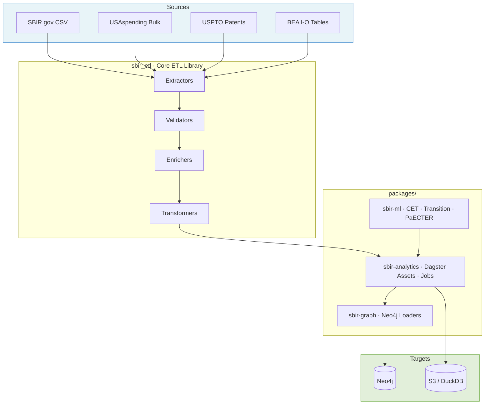

# SBIR ETL Pipeline

> Analyze $50B+ in SBIR/STTR funding data: Track technology transitions, patent outcomes, and economic impact of federal R&D investments.

[](https://github.com/hollomancer/sbir-analytics/actions)
[](https://www.python.org/downloads/)
[](https://opensource.org/licenses/MIT)

## What This Does

- 🔍 **533K+ SBIR awards** from 1983-present across all federal agencies
- 🚀 **40K-80K technology transitions** detected using 6 independent signals
- 📊 **CET classification** for Critical & Emerging Technology trend analysis
- 💰 **Economic impact** analysis with ROI and federal tax receipt estimates
- 🔗 **Patent ownership chains** tracking SBIR-funded innovation outcomes

## Prerequisites

- **Python 3.11+** (required)
- **Docker** (optional, for local Neo4j database)
- **AWS credentials** (optional, for cloud features and S3 data)

## Quick Start

### Local Development

Get started in 2 minutes:

```bash
git clone https://github.com/hollomancer/sbir-analytics
cd sbir-analytics
make install      # Install dependencies with uv
make dev          # Start Dagster UI
# Open http://localhost:3000
```

**Next steps:**

1. Materialize `raw_sbir_awards` asset in Dagster UI
2. Explore data in Neo4j Browser (<http://localhost:7474>)
3. See [Getting Started Guide](docs/getting-started/README.md) for detailed walkthrough

### Production Deployment

For production use, see [Deployment Guide](docs/deployment/README.md) for:

- **GitHub Actions** (orchestrates ETL pipelines via `dagster job execute`)
- **AWS Lambda** (serverless, for scheduled data downloads)

## Key Features

### Pipeline Architecture

- **Five-stage ETL**: Extract → Validate → Enrich → Transform → Load
- **Asset-based orchestration**: Dagster with dependency management
- **Data quality gates**: Comprehensive validation at each stage
- **Cloud-first design**: AWS S3 + Neo4j (Docker) + GitHub Actions

### Specialized Analysis Systems

| System | Purpose | Documentation |
|--------|---------|---------------|
| **Transition Detection** | Identify SBIR → federal contract transitions (≥85% precision) | [docs/transition/](docs/transition/) |
| **Phase II → III Latency** | Time-to-Phase-III survival analysis with matched-pair + KM frames | [docs/phase-transition-latency.md](docs/phase-transition-latency.md) |
| **CET Classification** | ML-based technology area classification | [docs/ml/](docs/ml/) |
| **ModernBERT-Embed** | Patent-award similarity using semantic embeddings | [docs/ml/paecter.md](docs/ml/paecter.md) |
| **Fiscal Returns** | Economic impact & ROI analysis using BEA I-O tables | [docs/fiscal/](docs/fiscal/) |
| **Patent Analysis** | USPTO patent chains and tech transfer tracking | [docs/schemas/patent-neo4j-schema.md](docs/schemas/patent-neo4j-schema.md) |

### Technology Stack

- **Orchestration**: Dagster 1.7+ (asset-based pipeline), GitHub Actions
- **Database**: Neo4j 5.x (graph database for relationships)
- **Processing**: DuckDB 1.0+ (analytical queries), Pandas 2.2+
- **Configuration**: Pydantic 2.8+ (type-safe YAML config)
- **Deployment**: Docker, AWS Lambda, GitHub Actions

## Research Questions Inventory

The pipeline is designed to answer a broad set of questions about the SBIR/STTR
program. Questions are grouped by theme; each links to the spec, doc, or feature
branch where the methodology lives. Items marked *(branch: …)* are in-progress
on a feature branch and not yet merged to `main`.

### Transitions & commercialization

- Did this SBIR-funded research result in a federal contract? — [docs/transition/overview.md](docs/transition/overview.md)
- Which SBIR-funded companies transitioned research into federal procurements? — [docs/transition/detection-algorithm.md](docs/transition/detection-algorithm.md)
- What is the transition effectiveness rate by CET area, agency, and firm size?
- What is the average time from award to transition by technology area?
- Which SBIR awards transitioned with patent backing, and what share of transitions are patent-enabled?
- Do firms show higher transition rates within the same awarding agency (agency continuity signal)?
- Which companies are consistent repeat performers across multiple awards? — [docs/queries/transition-queries.md](docs/queries/transition-queries.md)

### Phase II → Phase III latency

- What is the elapsed time between Phase II completion and first Phase III contract? — [docs/phase-transition-latency.md](docs/phase-transition-latency.md)
- What is the Phase II → Phase III survival probability by agency, firm size, and vintage?
- Does Phase II → Phase III latency vary by technology area?
- How much undercount exists in Phase III coding by agency (data-quality caveat)?

### DOD leverage ratio & follow-on funding

- What is the aggregate leverage ratio (non-SBIR DOD obligations ÷ SBIR/STTR obligations) for DOD SBIR firms? Does it reproduce NASEM's ~4:1? — [specs/leverage-ratio-analysis/](specs/leverage-ratio-analysis/)
- How does the leverage ratio stratify by award vintage, firm size, technology area, and firm experience (new vs. repeat)?
- What is the leverage ratio for civilian agencies (e.g., DOE)?
- How is the leverage ratio changing over time?
- What are match rates and entity-resolution coverage for reconciliation to NASEM?

### Patent linkage & knowledge spillover

- What is the marginal cost per patent by agency (award $ ÷ linked patents)? Does it match NIH's ~$1.5M benchmark? — [specs/patent-cost-spillover/](specs/patent-cost-spillover/)
- What is the spillover multiplier (non-SBIR patent citations to SBIR patents)? Does it match DOE's 3× benchmark?
- How do patent cost and spillover vary by technology area, firm size, and vintage?
- Which USPTO patents are linked to specific SBIR awards, and with what confidence? — [docs/transition/vendor-matching.md](docs/transition/vendor-matching.md)
- Which patents are semantically similar to specific SBIR awards (ModernBERT-Embed)? — [specs/paecter_analysis_layer/](specs/paecter_analysis_layer/)
- Can assignment chains show SBIR patent flow through prime contractors?

### Cross-agency technology taxonomy (CET)

- What is the federal SBIR portfolio composition across all 11 agencies by technology area? — [specs/cross-agency-taxonomy/](specs/cross-agency-taxonomy/)
- Which CET areas are funded by multiple agencies? Which are single-agency dominated (concentration risk)?
- How does the SBIR technology mix shift over time by agency?
- Which SBIR awards align with each CET area, and with what calibrated probability? — [docs/ml/cet-classifier.md](docs/ml/cet-classifier.md)
- Do SBIR awards and resulting contracts share the same technology focus (CET alignment signal)?

### Fiscal returns & Treasury ROI

- What are federal fiscal returns (tax receipts) from SBIR program spending? — [docs/fiscal/](docs/fiscal/)
- What is the payback period for Treasury investment recovery?
- How do fiscal returns stratify by state and NAICS sector?
- What are employment, wage, proprietor-income, and production impacts by award?
- Which NAICS sectors show the highest fiscal return multipliers?
- How robust are fiscal return estimates to parameter uncertainty (sensitivity bands)?

### Company categorization & performance

- Is this SBIR company primarily a product, service, or mixed-mode firm (based on full federal contract portfolio)? — [specs/company-categorization/](specs/company-categorization/)
- What percentage of a company's revenue comes from product vs. service contracts?
- How does company categorization relate to transition likelihood?
- Which SBIR companies show the highest transition success rate?

### Entity resolution & SBIR identification

- Is this SBIR recipient the same entity that won the federal contract? (UEI → CAGE → DUNS → fuzzy-name cascade) — [docs/transition/vendor-matching.md](docs/transition/vendor-matching.md)
- What is the entity-resolution match rate, and what fraction is exact vs. fuzzy?
- Have companies undergone acquisitions or rebrandings that break matching?
- Which federal awards are SBIR/STTR vs. non-SBIR, and with what confidence? — [docs/sbir-identification-methodology.md](docs/sbir-identification-methodology.md)
- What are false-positive rates for shared-ALN grant identification (e.g., NIH)?

### M&A & corporate-event detection

- Did an SBIR-funded company undergo merger or acquisition activity? — [specs/merger_acquisition_detection/](specs/merger_acquisition_detection/)
- How does M&A activity affect transition pathways?
- Can SEC EDGAR filings enrich SBIR company financial profiles (revenue, R&D, net income, assets)? *(branch: claude/integrate-sec-edgar-sbir)*
- For SBIR firms acquired by public companies, can inbound M&A be detected via 8-K full-text search? *(branch: claude/integrate-sec-edgar-sbir)*

### Continuous monitoring & rolling analytics

- What are current-quarter SBIR metrics and trends (weekly snapshots)? — [docs/research-plan-alignment.md](docs/research-plan-alignment.md)
- How have transition rates, patent output, and fiscal returns changed quarter-over-quarter?
- Which agencies are under-performing on transitions vs. historical baseline?
- What are forward-looking transition probabilities for Phase II awards nearing completion?

### Data imputation & coverage *(branch: claude/sbir-data-imputation-strategy)*

- Why is `award_date` missing on ~50% of records, and can it be recovered non-destructively? — [specs/data-imputation/](specs/data-imputation/) *(branch)*
- For each imputable field (award date, amount, contract dates, NAICS, identifiers), which methods are available and at what confidence?
- What is per-method backtest accuracy / MAE against ground-truth holdouts?
- Does the phase-transition precision benchmark remain ≥85% when imputed values are included?
- Can solicitation topics be mapped to NAICS (agency-topic crosswalk accuracy ≥75%)?
- Which downstream consumers (Neo4j, CET, transition detection) should use raw vs. effective values?

### External data source evaluation *(branch: claude/procurement-data-sources-eval)*

- Does SAM.gov Entity Extracts materially improve UEI backfill recall? — [specs/procurement-data-sources-eval/](specs/procurement-data-sources-eval/) *(branch)*
- Does the SAM.gov Opportunities API replace agency-page scraping for solicitation ceilings and periods of performance?
- Does FSCPSC NAICS prediction beat our abstract-nearest-neighbor baseline?
- Does the PSC Selection Tool provide the NAICS ↔ PSC crosswalk needed for topic-derived NAICS?
- Do DIIG CSIS lookup tables feed our NAICS hierarchy or agency normalization?
- Should we adopt third-party procurement-tools clients (e.g., `makegov/procurement-tools`, `tandemgov/fpds`)? — [docs/decisions/procurement-tools-evaluation.md](docs/decisions/procurement-tools-evaluation.md) *(branch)*

### Data quality & completeness

- What percentage of awards have valid NAICS codes, and what is the fallback usage rate?
- How many awards lack UEI/DUNS identifiers?
- What is the data-freshness lag for SBIR.gov, USAspending, USPTO, and BEA I-O sources?
- Which awards have missing or null critical fields (amount, dates, recipient)?
- How does SBIR.gov data reconcile with federal USAspending/FPDS records?

## Documentation

| Topic | Description |
|-------|-------------|
| [Getting Started](docs/getting-started/README.md) | Detailed setup guides for local, cloud, and ML workflows |
| [Architecture](docs/architecture/) | System design, patterns, and technical decisions |
| [Deployment](docs/deployment/) | Production deployment options and guides |
| [Testing](docs/testing/README.md) | Testing strategy, guides, and coverage |
| [Schemas](docs/schemas/) | Neo4j graph schema and data models |
| [API Reference](docs/api/README.md) | Code documentation and API reference |

See [Documentation Index](docs/index.md) for complete map.

## Architecture



**Data flows top-down**: sources are extracted by `sbir_etl`, orchestrated through Dagster assets in `sbir-analytics`, and loaded into Neo4j via `sbir-graph`. ML models in `sbir-ml` feed classification and scoring into the asset graph.

## Project Structure

```text
sbir-analytics/
├── sbir_etl/               # Core ETL library (extractors, enrichers, transformers, validators)
├── packages/
│   ├── sbir-analytics/    # Dagster orchestration (assets, jobs, sensors, CLI)
│   ├── sbir-graph/        # Neo4j loading and relationship creation
│   ├── sbir-ml/           # ML models (CET classification, transition, PaECTER)
│   └── sbir-rag/          # RAG system for award/patent search
├── tests/                  # Unit, integration, and E2E tests
├── config/                 # YAML configuration (base.yaml, thresholds)
├── docs/                   # Architecture, deployment, testing, schema docs
├── specs/                  # Feature specifications
├── infrastructure/cdk/     # AWS CDK stacks (security, storage, batch)
├── lambda/                 # Lambda layer dependency definitions
├── scripts/                # Pipeline runners, benchmarks, utilities
├── migrations/             # Database migration scripts
├── notebooks/              # Jupyter analysis notebooks
└── examples/               # Usage examples
```

See [CONTRIBUTING.md](CONTRIBUTING.md) for detailed breakdown.

## Common Commands

```bash
# Development
make install              # Install dependencies
make dev                  # Start Dagster UI
make test                 # Run tests
make lint                 # Run linters

# Docker (alternative)
make docker-build         # Build Docker image
make docker-up-dev        # Start development stack
make docker-test          # Run tests in container

# Data operations
make transition-run       # Run transition detection
make cet-run              # Run CET classification
```

See [Makefile](Makefile) for all available commands.

## Configuration

Configuration uses YAML files with environment variable overrides:

```bash
# Override any config using SBIR_ETL__SECTION__KEY pattern
export SBIR_ETL__NEO4J__URI="bolt://localhost:7687"
export SBIR_ETL__ENRICHMENT__BATCH_SIZE=200
```

See [Configuration Guide](docs/configuration.md) for details.

## Contributing

We welcome contributions! See [CONTRIBUTING.md](CONTRIBUTING.md) for:

- Development setup and workflow
- Code quality standards (black, ruff, mypy)
- Testing requirements (≥85% coverage)
- Pull request process

## Testing

```bash
make test                 # Run all tests
make test-unit            # Unit tests only
make test-integration     # Integration tests
make test-e2e             # End-to-end tests
```

See [Testing Guide](docs/testing/README.md) for details.

## License

This project is licensed under the [MIT License](LICENSE). Copyright (c) 2025 Conrad Hollomon.

## Acknowledgments

This project makes use of and is grateful for the following open-source tools and research:

- **[BEA API](https://apps.bea.gov/api/)** - Bureau of Economic Analysis Input-Output tables for fiscal impact modeling
- **[Bayesian Mixture-of-Experts](https://www.arxiv.org/abs/2509.23830)** - Research on calibration and uncertainty estimation by Albus Yizhuo Li
- **[ModernBERT-Embed](https://huggingface.co/nomic-ai/modernbert-embed-base)** - Embedding model by Nomic AI (768-dim, 8192 token context)
- **@SquadronConsult** - Help with SAM.gov data integration

## Support

- **Issues**: [GitHub Issues](https://github.com/hollomancer/sbir-analytics/issues)
- **Discussions**: [GitHub Discussions](https://github.com/hollomancer/sbir-analytics/discussions)
- **Documentation**: [docs/](docs/)
