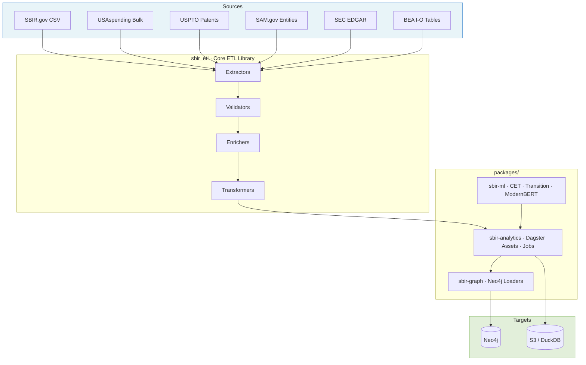

# SBIR ETL Pipeline

> Graph-based ETL over $50B+ in SBIR/STTR funding data. Tracks technology transitions, patent outcomes, and economic impact of federal R&D investments.

[](https://github.com/hollomancer/sbir-analytics/actions)
[](https://www.python.org/downloads/)
[](https://opensource.org/licenses/MIT)

Ingests SBIR.gov, USAspending, USPTO, SAM.gov, SEC EDGAR, and BEA data; orchestrates a five-stage pipeline (extract → validate → enrich → transform → load) with Dagster; and loads the result into Neo4j. The canonical inventory of questions the repo exists to answer lives in [docs/research-questions.md](docs/research-questions.md).

## Quick Start

```bash
git clone https://github.com/hollomancer/sbir-analytics
cd sbir-analytics
make install      # Install dependencies with uv
make dev          # Start Dagster UI at http://localhost:3000
```

See [docs/getting-started/](docs/getting-started/README.md) for a full walkthrough. `make help` lists all targets.

## Architecture



## Documentation

| Topic | Where |
|-------|-------|
| Documentation index | [docs/index.md](docs/index.md) |
| Research questions (north star) | [docs/research-questions.md](docs/research-questions.md) |
| Getting started | [docs/getting-started/](docs/getting-started/README.md) |
| Architecture | [docs/architecture/](docs/architecture/) |
| Deployment | [docs/deployment/](docs/deployment/README.md) |
| Configuration | [docs/configuration.md](docs/configuration.md) |
| Testing | [docs/testing/](docs/testing/README.md) |
| Schemas | [docs/schemas/](docs/schemas/) |
| Contributing | [CONTRIBUTING.md](CONTRIBUTING.md) |

## License

MIT — see [LICENSE](LICENSE). Copyright (c) 2025 Conrad Hollomon.

## Acknowledgments

- [BEA API](https://apps.bea.gov/api/) — Bureau of Economic Analysis Input-Output tables
- [stateior](https://github.com/USEPA/stateior) — EPA state-level I-O model
- [ModernBERT-Embed](https://huggingface.co/nomic-ai/modernbert-embed-base) — Nomic AI embedding model
- [SEC EDGAR EFTS](https://efts.sec.gov) — SEC full-text filing search
- [SAM.gov Data Services](https://api.sam.gov) — federal entity registration data
- [Bayesian Mixture-of-Experts](https://www.arxiv.org/abs/2509.23830) — calibration research by Albus Yizhuo Li
- @SquadronConsult — SAM.gov integration help
