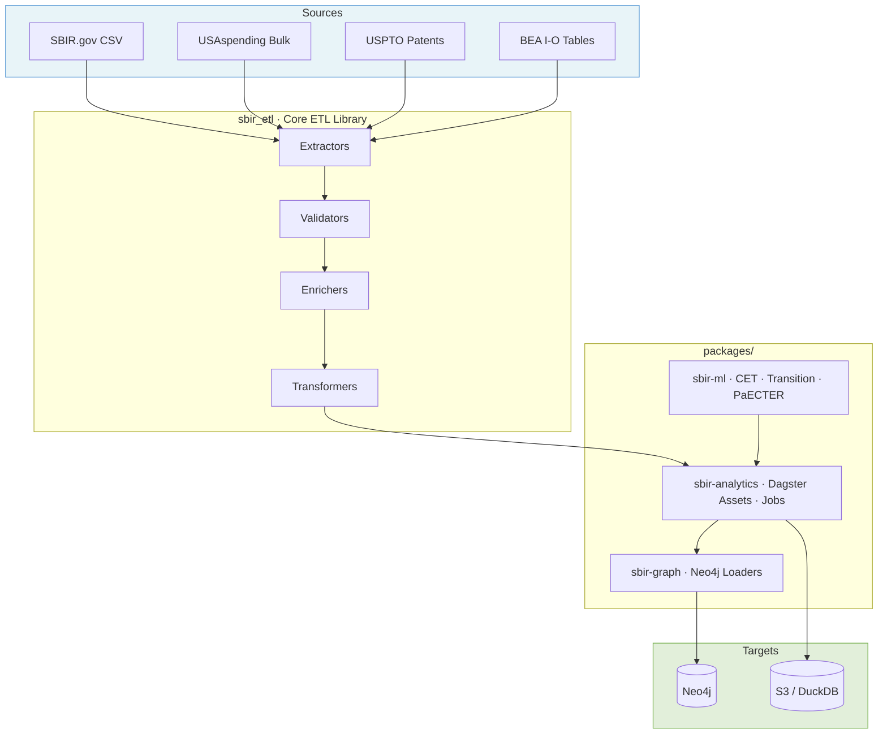

# SBIR ETL Pipeline

> Analyze $50B+ in SBIR/STTR funding data: Track technology transitions, patent outcomes, and economic impact of federal R&D investments.

[](https://github.com/hollomancer/sbir-analytics/actions)
[](https://www.python.org/downloads/)
[](https://opensource.org/licenses/MIT)

## What This Does

- 🔍 **533K+ SBIR awards** from 1983-present across all federal agencies
- 🚀 **40K-80K technology transitions** detected using 6 independent signals
- 📊 **CET classification** for Critical & Emerging Technology trend analysis
- 💰 **Economic impact** analysis with ROI and federal tax receipt estimates
- 🔗 **Patent ownership chains** tracking SBIR-funded innovation outcomes

For the full inventory of SBIR policy and research questions the pipeline is
designed to answer — organized by policy area and cross-referenced to NASEM,
GAO, and peer-reviewed benchmarks — see
[docs/research-questions.md](docs/research-questions.md).

## Prerequisites

- **Python 3.11+** (required)
- **Docker** (optional, for local Neo4j database)
- **AWS credentials** (optional, for cloud features and S3 data)

## Quick Start

### Local Development

Get started in 2 minutes:

```bash
git clone https://github.com/hollomancer/sbir-analytics
cd sbir-analytics
make install      # Install dependencies with uv
make dev          # Start Dagster UI
# Open http://localhost:3000
```

**Next steps:**

1. Materialize `raw_sbir_awards` asset in Dagster UI
2. Explore data in Neo4j Browser (<http://localhost:7474>)
3. See [Getting Started Guide](docs/getting-started/README.md) for detailed walkthrough

### Production Deployment

For production use, see [Deployment Guide](docs/deployment/README.md) for:

- **GitHub Actions** (orchestrates ETL pipelines via `dagster job execute`)
- **AWS Lambda** (serverless, for scheduled data downloads)

## Key Features

### Pipeline Architecture

- **Five-stage ETL**: Extract → Validate → Enrich → Transform → Load
- **Asset-based orchestration**: Dagster with dependency management
- **Data quality gates**: Comprehensive validation at each stage
- **Cloud-first design**: AWS S3 + Neo4j (Docker) + GitHub Actions

### Specialized Analysis Systems

| System | Purpose | Documentation |
|--------|---------|---------------|
| **Transition Detection** | Identify SBIR → federal contract transitions (≥85% precision) | [docs/transition/](docs/transition/) |
| **Phase II → III Latency** | Time-to-Phase-III survival analysis with matched-pair + KM frames | [docs/phase-transition-latency.md](docs/phase-transition-latency.md) |
| **CET Classification** | ML-based technology area classification | [docs/ml/](docs/ml/) |
| **ModernBERT-Embed** | Patent-award similarity using semantic embeddings | [docs/ml/paecter.md](docs/ml/paecter.md) |
| **Fiscal Returns** | Economic impact & ROI analysis using BEA I-O tables | [docs/fiscal/](docs/fiscal/) |
| **Patent Analysis** | USPTO patent chains and tech transfer tracking | [docs/schemas/patent-neo4j-schema.md](docs/schemas/patent-neo4j-schema.md) |

### Technology Stack

- **Orchestration**: Dagster 1.7+ (asset-based pipeline), GitHub Actions
- **Database**: Neo4j 5.x (graph database for relationships)
- **Processing**: DuckDB 1.0+ (analytical queries), Pandas 2.2+
- **Configuration**: Pydantic 2.8+ (type-safe YAML config)
- **Deployment**: Docker, AWS Lambda, GitHub Actions

## Documentation

| Topic | Description |
|-------|-------------|
| [Getting Started](docs/getting-started/README.md) | Detailed setup guides for local, cloud, and ML workflows |
| [Research Questions](docs/research-questions.md) | Inventory of SBIR analytical questions the pipeline answers |
| [Architecture](docs/architecture/) | System design, patterns, and technical decisions |
| [Deployment](docs/deployment/) | Production deployment options and guides |
| [Testing](docs/testing/README.md) | Testing strategy, guides, and coverage |
| [Schemas](docs/schemas/) | Neo4j graph schema and data models |
| [API Reference](docs/api/README.md) | Code documentation and API reference |

See [Documentation Index](docs/index.md) for complete map.

## Architecture



**Data flows top-down**: sources are extracted by `sbir_etl`, orchestrated through Dagster assets in `sbir-analytics`, and loaded into Neo4j via `sbir-graph`. ML models in `sbir-ml` feed classification and scoring into the asset graph.

## Project Structure

```text
sbir-analytics/
├── sbir_etl/               # Core ETL library (extractors, enrichers, transformers, validators)
├── packages/
│   ├── sbir-analytics/    # Dagster orchestration (assets, jobs, sensors, CLI)
│   ├── sbir-graph/        # Neo4j loading and relationship creation
│   ├── sbir-ml/           # ML models (CET classification, transition, PaECTER)
│   └── sbir-rag/          # RAG system for award/patent search
├── tests/                  # Unit, integration, and E2E tests
├── config/                 # YAML configuration (base.yaml, thresholds)
├── docs/                   # Architecture, deployment, testing, schema docs
├── specs/                  # Feature specifications
├── infrastructure/cdk/     # AWS CDK stacks (security, storage, batch)
├── lambda/                 # Lambda layer dependency definitions
├── scripts/                # Pipeline runners, benchmarks, utilities
├── migrations/             # Database migration scripts
├── notebooks/              # Jupyter analysis notebooks
└── examples/               # Usage examples
```

See [CONTRIBUTING.md](CONTRIBUTING.md) for detailed breakdown.

## Common Commands

```bash
# Development
make install              # Install dependencies
make dev                  # Start Dagster UI
make test                 # Run tests
make lint                 # Run linters

# Docker (alternative)
make docker-build         # Build Docker image
make docker-up-dev        # Start development stack
make docker-test          # Run tests in container

# Data operations
make transition-run       # Run transition detection
make cet-run              # Run CET classification
```

See [Makefile](Makefile) for all available commands.

## Configuration

Configuration uses YAML files with environment variable overrides:

```bash
# Override any config using SBIR_ETL__SECTION__KEY pattern
export SBIR_ETL__NEO4J__URI="bolt://localhost:7687"
export SBIR_ETL__ENRICHMENT__BATCH_SIZE=200
```

See [Configuration Guide](docs/configuration.md) for details.

## Contributing

We welcome contributions! See [CONTRIBUTING.md](CONTRIBUTING.md) for:

- Development setup and workflow
- Code quality standards (black, ruff, mypy)
- Testing requirements (≥85% coverage)
- Pull request process

## Testing

```bash
make test                 # Run all tests
make test-unit            # Unit tests only
make test-integration     # Integration tests
make test-e2e             # End-to-end tests
```

See [Testing Guide](docs/testing/README.md) for details.

## License

This project is licensed under the [MIT License](LICENSE). Copyright (c) 2025 Conrad Hollomon.

## Acknowledgments

This project makes use of and is grateful for the following open-source tools and research:

- **[BEA API](https://apps.bea.gov/api/)** - Bureau of Economic Analysis Input-Output tables for fiscal impact modeling
- **[Bayesian Mixture-of-Experts](https://www.arxiv.org/abs/2509.23830)** - Research on calibration and uncertainty estimation by Albus Yizhuo Li
- **[ModernBERT-Embed](https://huggingface.co/nomic-ai/modernbert-embed-base)** - Embedding model by Nomic AI (768-dim, 8192 token context)
- **@SquadronConsult** - Help with SAM.gov data integration

## Support

- **Issues**: [GitHub Issues](https://github.com/hollomancer/sbir-analytics/issues)
- **Discussions**: [GitHub Discussions](https://github.com/hollomancer/sbir-analytics/discussions)
- **Documentation**: [docs/](docs/)
