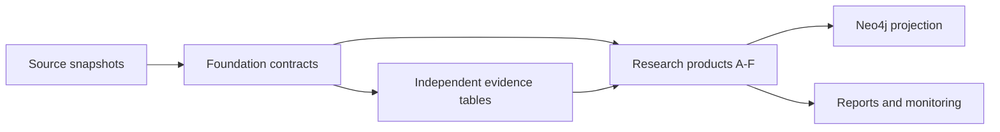

# Dagster Reorganization Plan: Research-Product Architecture

**Status:** Proposed

**Date:** 2026-08-03

**Scope:** Dagster definitions, assets, jobs, automation, and publication boundaries

**Canonical research inventory:** [Research Questions Inventory](../research-questions.md)

## Decision

Reorganize Dagster around stable data contracts and the research products they support,
not around a single repository-wide ETL sweep.

Neo4j is a publication and exploration projection. It is not the canonical system of
record. Source snapshots and validated tabular products must remain reproducible without
Neo4j, and graph publication must occur only after its inputs pass blocking semantic checks.

The target flow is:



This preserves the existing five-stage ETL intent while making the operational boundary
match the research architecture described in `docs/research-questions.md`.

## Why change

The current Dagster graph is broad but does not consistently express the dependencies that
make research results reproducible.

The inventory on 2026-08-03 found:

| Area | Current state | Consequence |
| --- | --- | --- |
| Definitions | 105 asset definitions representing 109 asset keys, 47 checks, 22 jobs, 10 schedules, and 5 sensors | A single code location carries unrelated operational and research workloads |
| Grouping | 22 groups; 18 assets remain in `default` | Group names do not provide a dependable ownership or product boundary |
| Discovery | Assets and jobs are imported by filesystem scanning; failed job imports can become placeholders | Definition-load failures can be hidden and deployed contents can vary with optional dependencies |
| Broad jobs | `sbir_analytics_job` selects every asset and is scheduled daily outside the server profile; `core_refresh_job` is derived by excluding a dynamic list of heavy assets | New assets can enter production automation without an explicit scheduling decision |
| Heavy profile | Disabling heavy assets still loads 64 assets and 34 checks; phase-transition classification loads optional ML dependencies | The lightweight server boundary is implicit and incomplete |
| Lineage | Phase II and Phase III assets read files directly and declare no upstream assets | Dagster cannot determine source vintage or safely order/backfill transition analysis |
| Source acquisition | Several download workflows are op jobs rather than versioned assets | Source changes, lineage, checks, and partitions are inferred from event-log metadata |
| Automation | Success sensors react to run completion, not to source changes plus blocking semantic checks | A technically successful run can trigger publication of semantically invalid data |
| USAspending iteration | `usaspending_iterative_enrichment_job` selects the ledger and stale-award assets but omits the refresh op | The named job identifies stale data without refreshing it |
| Weekly refresh | SBIR acquisition, validation, optional enrichments, and graph mutation share one run | An optional-source outage blocks unrelated work, while graph publication is coupled to ingestion |

The rollout audit supplied concrete examples of these risks:

- the source contained 46,162 award-key collisions that were not detected until a graph load;
- a Phase III classifier returned zero matches for 2,280 coded transactions because archive
  phase values were descriptive labels;
- a weekly report included future-dated records because its interval had no upper bound.

These are data-contract failures. Scheduling more frequently would only reproduce them more
quickly.

## Architectural boundaries

### 1. Sources

Create immutable or versioned snapshots of external data:

- SBIR/STTR awards;
- SAM.gov entities;
- USAspending transactions and archives;
- USPTO patents and assignments;
- SEC/Form D and other capital evidence;
- BEA and other economic reference data.

Each source asset emits a manifest containing at least:

- source name and source vintage;
- retrieval timestamp and content hash;
- physical location;
- row count and declared grain;
- schema version;
- validation status.

Existing download scripts can remain the implementation beneath these assets during the
migration. Dagster should model the output data, not merely the command that fetched it.

### 2. Foundation

Foundation assets answer the shared questions in E1-E5:

- canonical SBIR/STTR award records;
- organization identity and aliases;
- contract-award identity and grain;
- technology, program, geography, and agency taxonomies;
- reusable data-quality profiles.

Primary keys must be source-grain keys. A display identifier such as an award number must not
be assumed unique. The Neo4j award identity contract must be resolved before another full graph
replay; the likely shape is a composite of source system, source record identifier, and any
program/phase component required by the source grain.

### 3. Evidence

Model enrichments as independent, keyed evidence tables rather than requiring every field to
join into one wide `enriched_sbir_awards` asset:

- SAM entity attributes;
- procurement and follow-on contract links;
- patent and assignment links;
- CET classifications;
- Form D, UCC, acquisition, and other capital events;
- scored or probabilistic linkages with method, version, and confidence.

An unavailable optional source should make only its dependent products stale. It should not
prevent canonical award validation or unrelated products from materializing.

### 4. Research products

Give each product family an explicit Dagster group and job tied to the canonical question IDs:

| Product group | Research scope | Representative outputs |
| --- | --- | --- |
| `industrial_base` | A: national security, industrial base, and supply chain | agency/technology portfolios, concentration, choke-point indicators |
| `commercialization` | B and A3: commercialization and follow-on funding | Phase II-to-III links, transition latency, funding multipliers, survival |
| `innovation` | C: innovation and knowledge generation | patent links, assignment chains, citation and technology measures |
| `fiscal` | D: economic and fiscal impact | reconciled spending, leverage, employment and regional estimates |
| `capital` | F: capital formation and entrepreneurial finance | fundraising, liens, acquisitions, and capital pathway measures |
| `monitoring` | E6: rolling program analytics | dated snapshots, deltas, alerts, and data-quality trends |

Every materialization should carry its research question IDs, analysis version, source vintages,
and epistemic tier. A product may support more than one question, but it must not be scheduled
merely because it exists in the repository.

### 5. Publishing

Treat these as downstream, replaceable projections:

- Neo4j graph snapshots;
- weekly operational/research reports;
- API or export snapshots;
- dashboards and notifications.

Publication jobs consume checked product assets. They do not own extraction, canonicalization,
or research logic. Graph updates must be reversible and must fail before mutation when identity
or cardinality contracts do not hold.

## Target code organization

The destination is a small explicit definitions layer over domain-organized assets:

```text
packages/sbir-analytics/sbir_analytics/
  definitions/
    registry.py
    core.py
    research.py
    heavy.py
    monitoring.py
  assets/
    sources/
    foundation/
    evidence/
    products/
      industrial_base/
      commercialization/
      innovation/
      fiscal/
      capital/
      monitoring/
    publishing/
  contracts/
  automation/
```

The physical moves should be gradual. The first change should introduce explicit registries and
wrapper definitions around existing modules. Moving implementation files is valuable only after
the new boundaries are proven, because a large rename-only PR would obscure behavioral changes.

Each asset definition should expose consistent metadata:

- `stage`: source, foundation, evidence, product, or publishing;
- `research_questions`: canonical A-F/E identifiers where applicable;
- `owner`;
- `resource_class`: lightweight, network, memory-intensive, or accelerator;
- `grain` and primary-key contract;
- `source_vintage` or partition;
- `analysis_version` for derived evidence and products.

## Definitions and execution profiles

Replace filesystem auto-discovery with imports in `definitions/registry.py`. A missing dependency
or invalid definition must fail that code location to load; Dagster must never substitute a
placeholder job.

Use explicit logical profiles:

| Profile | Contents | Default automation |
| --- | --- | --- |
| `core` | source, foundation, and lightweight evidence assets | source-specific schedules only |
| `research` | bounded product marts for A-F | scheduled only for approved products |
| `heavy` | CET/ModernBERT, USPTO NLP, and other resource-intensive analyses | off by default |
| `monitoring` | E6 snapshots, reports, and publication assets | approved publish cadence |

Start with logical definitions in the existing code server. Split these into separate processes
only after imports, resources, and ownership demonstrate that isolation is needed. A multi-code-
location deployment is not a prerequisite for correcting the asset graph.

## Jobs and automation

### Jobs

Replace broad selections with named, contract-tested selections:

- `sbir_foundation_refresh`;
- `sam_entity_evidence_refresh`;
- `procurement_evidence_refresh`;
- `patent_evidence_refresh`;
- `capital_evidence_refresh`;
- `commercialization_snapshot`;
- `industrial_base_snapshot`;
- `innovation_snapshot`;
- `fiscal_snapshot`;
- `capital_formation_snapshot`;
- `program_monitoring_snapshot`;
- `publish_graph_snapshot`;
- `publish_weekly_report`.

There should be no scheduled `AssetSelection.all()` job and no definition whose production
contents depend on subtracting a dynamically discovered heavy-asset set.

### Partitions and change detection

Use partitions only where they express a reproducibility boundary:

- snapshot date for external source captures and monitoring outputs;
- fiscal year for bounded procurement and fiscal analyses;
- analysis version for models or research methods when a result must coexist with a prior method.

Automation should run downstream work only when:

1. the upstream source hash or relevant partition changed;
2. required blocking checks passed; and
3. the selected product has an approved cadence.

Do not scrape prior step events to infer whether data changed. Put hashes and vintages on asset
materializations and use Dagster's asset lineage/automation APIs.

### Blocking contracts

At minimum, enforce before downstream publication:

- uniqueness at the declared source grain;
- schema and required-field validity;
- temporal bounds, including future-date handling;
- classifier conservation and non-zero expectations when the source contains coded records;
- relationship endpoint coverage;
- graph node/relationship cardinality expectations;
- prohibition of impossible progression self-loops;
- traceability from every product row to input vintage and analysis version.

## Current-job disposition

| Current job or family | Disposition |
| --- | --- |
| `sbir_analytics_job` | Retire; it is an unsafe repository-wide scheduling boundary |
| `core_refresh_job` | Retire after equivalent explicit jobs exist |
| `sbir_weekly_refresh_job` | Split into foundation, optional evidence, and publishing jobs |
| Source download op jobs | Wrap/convert to versioned source assets with manifests |
| `transition_mvp_job`, `transition_full_job`, `transition_analytics_job` | Consolidate behind explicit commercialization product selections |
| Phase-transition archive/latency jobs | Keep as B/A3 products, but declare all source and evidence dependencies |
| `usaspending_iterative_enrichment_job` | Replace or repair; its current selection omits the refresh operation |
| USPTO validation and AI jobs | Separate source validation, patent evidence, and heavy analysis |
| CET, ModernBERT, and fiscal full jobs | Place in the heavy research profile, unscheduled by default |
| Weekly report job | Publish only after a checked monitoring snapshot |
| SEC EDGAR work | Treat as capital evidence, not as an implicit graph-side effect |

## Migration sequence

### Phase 0 — Freeze and characterize

Goal: protect current behavior while making it measurable.

- record the expected definitions inventory and scheduled selections in tests;
- capture representative source, table, research-product, and graph cardinalities;
- document current source vintages and direct filesystem inputs;
- keep all currently disabled schedules disabled.

Exit gate: the repository can detect an accidental change to any production job selection.

### Phase 1 — Make definitions explicit

Goal: remove implicit deployment contents.

- add `definitions/registry.py` with explicit asset, check, job, schedule, sensor, and resource lists;
- eliminate placeholder jobs and broad import exception handling;
- replace dynamic heavy-prefix filtering with declared profiles;
- retire the daily all-assets and derived weekly-core schedules;
- mark optional ML-backed transition assets as heavy until their dependency boundary is isolated.

Exit gate: every profile loads without warnings, and no scheduled job uses all-assets selection.

### Phase 2 — Establish source contracts

Goal: make every external input visible and reproducible.

- expose source downloads and archives as partitioned/versioned assets;
- emit uniform source manifests and blocking validation checks;
- declare external assets for inputs that cannot yet be materialized by Dagster;
- remove event-log scraping from source chaining.

Exit gate: every direct input file used by a scheduled product has a Dagster lineage edge and a
recorded source vintage.

### Phase 3 — Correct foundation and evidence boundaries

Goal: make shared identity and enrichment dependable.

- define the source-grain award identity contract and migrate graph keys;
- separate canonical SBIR awards from SAM, USAspending, patent, CET, and capital evidence;
- declare Phase II/III and transition dependencies instead of reading undeclared files;
- repair the USAspending iterative refresh so the job performs the operation its name promises.

Exit gate: optional-source failure does not block unrelated products, and a full graph dry run
passes uniqueness and progression checks before mutation.

### Phase 4 — Form research products

Goal: align execution with questions A-F.

- wrap existing analytics in the six product groups;
- consolidate overlapping transition jobs first, because bounded procurement evidence is already
  available and directly supports B/A3;
- add source-vintage, method-version, and question-ID metadata;
- distinguish research output checks from pipeline-operability checks.

Recommended order: commercialization, program monitoring, industrial base, innovation, fiscal,
then capital formation. This follows present data readiness, not the importance of the questions.

Exit gate: every scheduled product maps to canonical research questions and can be reproduced
from recorded source partitions.

### Phase 5 — Decouple publication

Goal: make serving safe and replaceable.

- publish Neo4j only from checked foundation/evidence/product assets;
- publish reports from dated monitoring snapshots;
- add pre-mutation graph plans, backups, cardinality checks, and post-load verification;
- backfill representative partitions and compare them with the Phase 0 baseline.

Exit gate: publication is reversible, does not mutate canonical inputs, and preserves agreed
row-count and research-metric tolerances.

### Phase 6 — Retire legacy paths

Goal: remove ambiguity only after the new path is routine.

- run two successful approved cadences through the new jobs;
- remove superseded jobs, schedules, sensors, dynamic discovery, and compatibility wrappers;
- update the self-hosted server runbook with the final job names and rollback procedures.

Exit gate: no production schedule, sensor, or runbook command references a legacy definition.

## First implementation slice

The next PR should be deliberately narrow and behavior-preserving:

1. add an explicit definitions registry for the current lightweight server profile;
2. add tests that pin job selections and assert that no placeholder definition is produced;
3. remove the daily all-assets and derived weekly-core schedules from deployable definitions;
4. declare the heavy/light profile membership explicitly;
5. leave asset implementations and physical module locations unchanged.

This creates a safe boundary for the later source-contract and research-product migrations. The
award identity decision and graph-key migration should be a separate reviewed change because it
changes persisted data semantics.

## Acceptance criteria for the completed reorganization

- Definitions load deterministically and fail visibly on missing required modules.
- Every scheduled job has an explicit, tested asset selection and owner.
- No production schedule is based on `AssetSelection.all()` or dynamic exclusion.
- Every external input is an asset or declared external asset with source-vintage metadata.
- Every research product identifies its canonical question IDs and epistemic tier.
- Optional evidence outages do not block unrelated foundation or product assets.
- Blocking semantic checks gate sensors and publishing jobs.
- Neo4j can be rebuilt from canonical assets and restored without data loss.
- Product and graph parity are demonstrated against the Phase 0 baseline.
- The self-hosted server runbook describes only the new definitions and their rollback path.

## Non-goals

This effort does not:

- rewrite working extractors or research algorithms merely to move files;
- enable heavy or experimental analyses on the self-hosted server;
- change the research methodology or the canonical research-question inventory;
- move canonical data away from the current self-hosted server storage architecture;
- require a multi-process Dagster deployment before logical boundaries are proven;
- combine the full migration into one pull request.

## Related architecture contracts

- [Pipeline Orchestration Patterns](../steering/pipeline-orchestration.md)
- [Data Quality Contract](../steering/data-quality.md)
- [Enrichment Patterns](../steering/enrichment-patterns.md)
- [Company Identity Contract](../steering/company-identity.md)
- [Epistemic Tiers](../steering/epistemic-tiers.md)
- [Neo4j Graph Database Patterns](../steering/neo4j-patterns.md)
- [Self-hosted server runbook](../deployment/self-hosted-server.md)
