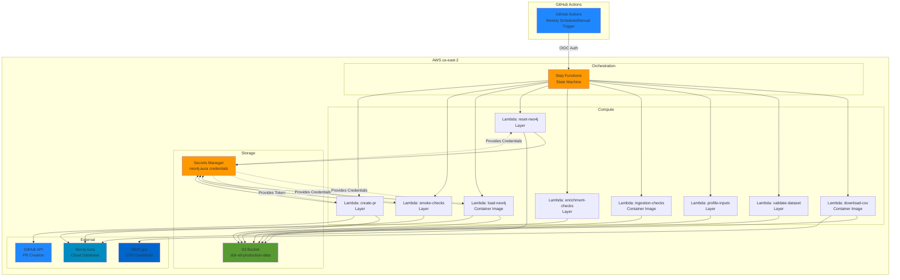
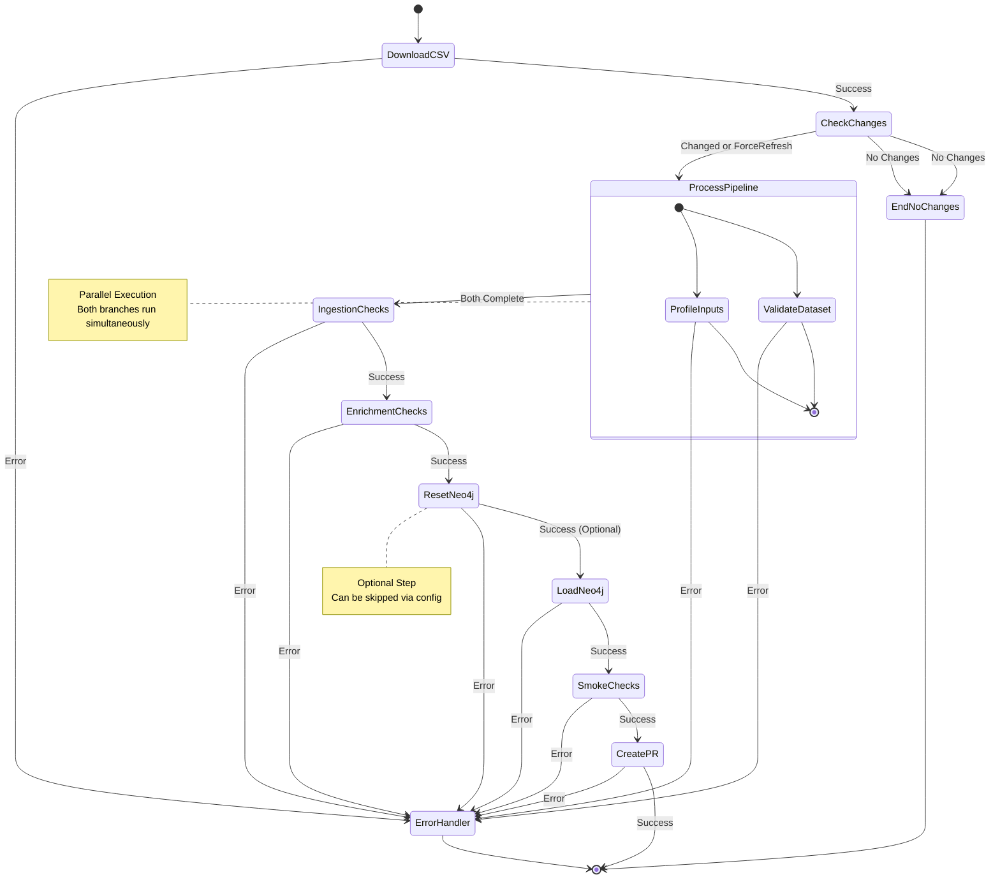
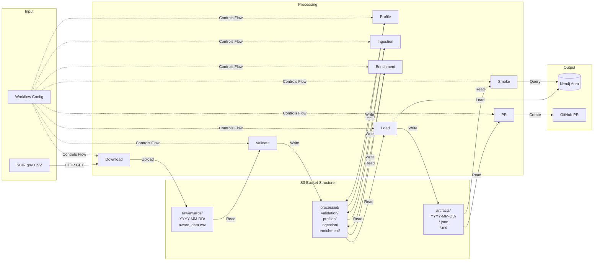
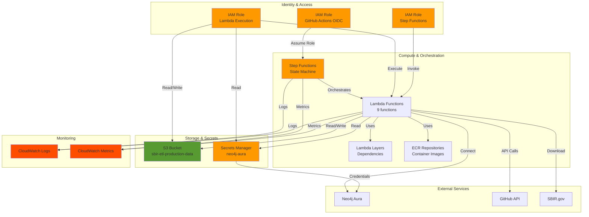
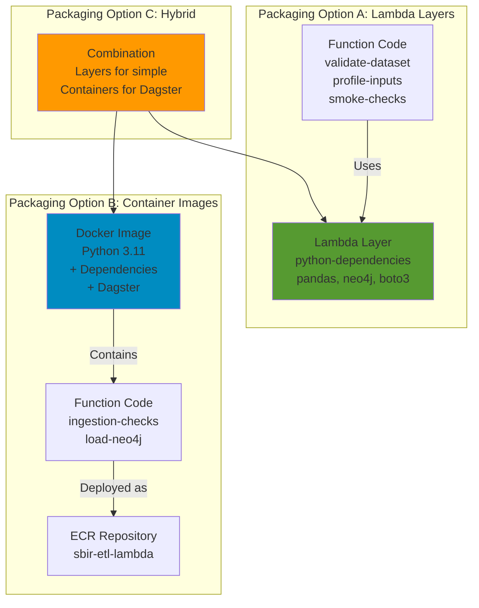

# AWS Infrastructure Architecture Diagrams

This document contains visual diagrams of the AWS infrastructure architecture for the SBIR ETL pipeline.

## High-Level Architecture

## Step Functions State Machine Flow

## Data Flow Diagram

## AWS Services Relationship Diagram

## Lambda Packaging Strategy Diagram

