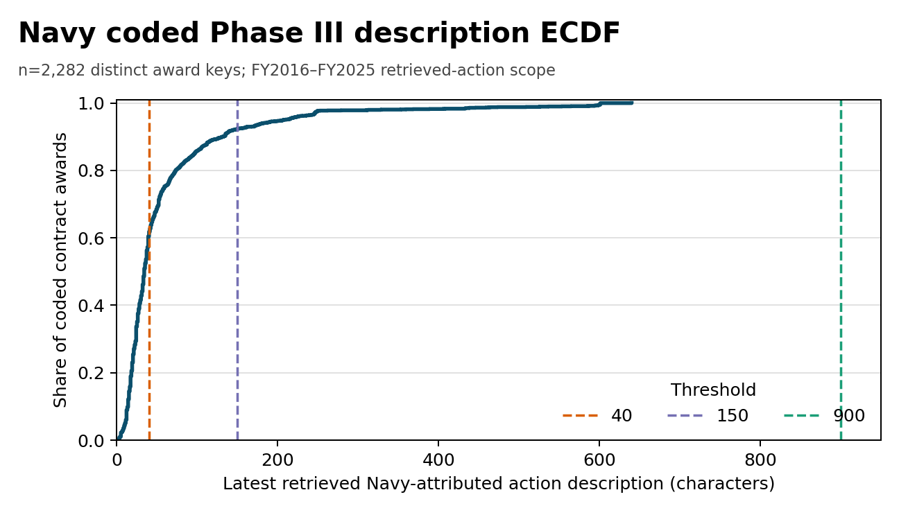
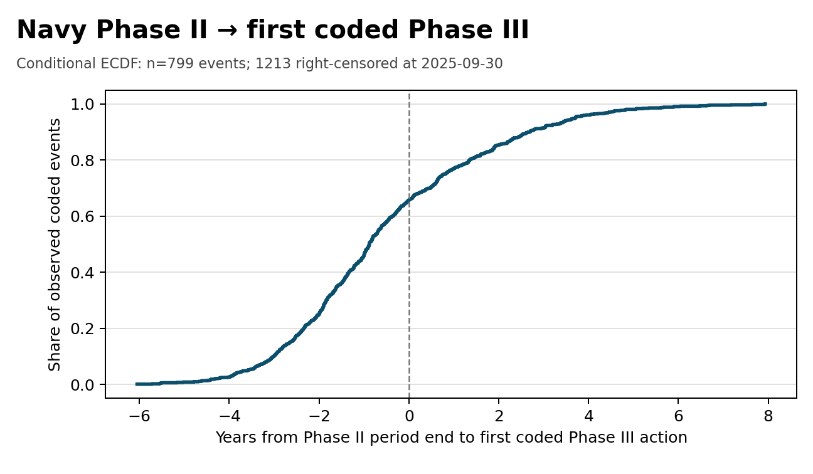

# Navy Phase III transition readout v1

> **Exploratory — non-citable.** Prepared independently in a personal capacity; no agency
> affiliation is asserted. Descriptive only: no office ranking, statutory undercount
> claim, or recommendation.

**Frame.** Public SBIR.gov/FPDS data through 2025-09-30; federal FY2016–FY2025.
“Navy” is SBIR.gov DoD/Navy or FPDS SR3/ST3 with awarding **or** funding sub-tier 1700.
FPDS actions are post-filtered, compound-key deduplicated, and represented by the latest
retrieved Navy-attributed action. The coded set is the observed complement of the uncoded-claim
population. Counts and coded-signal incidence are lower bounds on public coded-channel capture;
exact-UEI, no-topic pairing means they are not bounds on true project transitions. Description
completeness rates are conditional upper-bound proxies for uncoded claims only if coded records
are at least as complete—an untested assumption.

**Sources/provenance:** [SBIR.gov bulk](https://data.www.sbir.gov/mod_awarddatapublic/award_data.csv),
[FPDS public Atom](https://www.fpds.gov/ezsearch/FEEDS/ATOM?FEEDNAME=PUBLIC),
[SEC EDGAR](https://www.sec.gov/edgar), and
[SEC EFTS](https://efts.sec.gov/LATEST/search-index); hashes are in the
[aggregate summary](navy-transition-v1.summary.json).

## A — Coverage and description field

Denominators: 4,828 Navy Phase I and
2,780 Phase II awards; 2,282 SR3/ST3 keys in
the same FY window (2,000 DoN-awarded,
2,263 DoN-funded, 1,981
both; annual counts use the union).

| Latest retrieved-action FY | Phase I awards | Phase II awards | Coded Phase III contracts |
|---:|---:|---:|---:|
| FY2016 | 458 | 224 | 229 |
| FY2017 | 533 | 284 | 203 |
| FY2018 | 433 | 280 | 139 |
| FY2019 | 409 | 344 | 126 |
| FY2020 | 704 | 290 | 136 |
| FY2021 | 493 | 274 | 174 |
| FY2022 | 382 | 243 | 200 |
| FY2023 | 411 | 221 | 197 |
| FY2024 | 472 | 303 | 283 |
| FY2025 | 533 | 317 | 595 |

Latest retrieved-action descriptions have median 34 characters;
902/2,282 (39.5%) reach 40,
177/2,282 (7.8%) reach 150, and
0/2,282 (0.0%) reach 900.

The requested **historical, unreproduced** DoD comparator is traceable only to a legacy
[coded pull](https://github.com/hollomancer/sbir-analytics/blob/d844f2b0/scripts/phase3_benchmark/m0a_coded_pull.py),
[threshold script](https://github.com/hollomancer/sbir-analytics/blob/48f13305/scripts/phase3_benchmark/dod_within_retrieval.py),
and [median assertion](https://github.com/hollomancer/sbir-analytics/blob/e51574be/specs/phase3-match-benchmark/eval-validity.md):
FY2016–25 DoD SR3/ST3 n=6,351, median 42, 53.6% ≥40,
88.5% <150, and 0% ≥900. The median has no committed generator and
[tracked prose](../../specs/phase3-match-benchmark/mse-dark-phase3.md) says 43; these are quoted,
not method-matched. Navy is 92.2% <150. The 900 mark is analytic,
not a statutory §638 floor.

## B — Phase II to first coded Phase III

At risk: 2,012 Phase II awards (775
exact-UEI firms) ending by the cut. 799
(39.7%) pair to the first action of a distinct same-UEI coded
award on/after the Phase II award date; 1,213 are right-censored.
At firm grain, 618/775 have no coded event:
not-yet-observed, not zero.
Quantiles condition on events. They retain 525 actions during
Phase II performance, so median completion-to-action latency is
-322 days (-0.88 years).
Undercoding makes the rate a coded-channel floor; unrelated same-firm awards can bias it upward
against true transitions, so it is not a true-transition bound.

| p10 | p20 | p30 | p40 | p50 | p60 | p70 | p80 | p90 |
|---:|---:|---:|---:|---:|---:|---:|---:|---:|
| -1,098 (-3.01) | -854 (-2.34) | -672 (-1.84) | -487 (-1.33) | -322 (-0.88) | -134 (-0.37) | 166 (0.45) | 493 (1.35) | 971 (2.66) |

*Cells: days (years) from Phase II period end; n=799 observed events.*

| A. Description ECDF and 40/150/900 thresholds | B. Conditional latency ECDF |
|:---:|:---:|
|  |  |

## C — Description emptiness versus NAICS/PSC missingness

In n=2,282, blank description=0, missing
NAICS=1, and missing PSC=0.
Correlation was not estimable because at least one binary input was constant; Panel C is therefore blocked rather than replaced with a different outcome.

## D — Recent external capital/acquisition signals

Among 1,686 normalized Navy firms, the 2024-09-01–
2026-08-31 high/medium screens are:

| Public signal | High | Medium | Unique firms |
|---|---:|---:|---:|
| Positive non-combination Form D filing | 43 | 4 | 47 |
| EFTS acquisition in window | — | — | blocked |
| Either recent signal | — | — | blocked |

No names are emitted. Form D is participation, not verified capital received. EFTS stores
all-time types plus the latest mention of any type, so it cannot date the requested acquisition
signal; that branch and its union are blocked rather than replaced with a proxy.

## Limitations

SR3/ST3 and public/exact-UEI coverage miss transitions; firm-level pairing can reuse one event
across awards. Censoring is administrative, not evidence of no transition. Modification text
may not describe the base award.
DoN awarding/funding attribution is unioned and may differ. Form D amendments/name matches and
aggregated EFTS mentions can false-positive. Source cuts differ and are recorded. Nothing here
identifies a mechanism.
