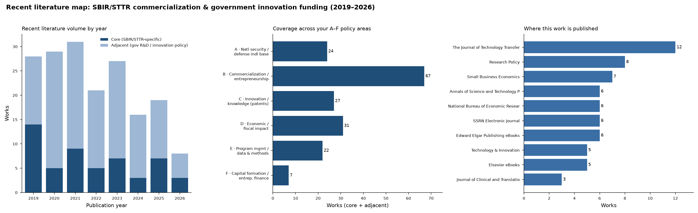

# Recent Literature Map — SBIR/STTR Commercialization & Government Innovation Funding

**Scope:** Empirical and policy research, 2019–2026, on the U.S. Small Business Innovation
Research (SBIR) and Small Business Technology Transfer (STTR) programs and the broader
economics of government innovation funding. Built to mirror the six policy areas (A–F) of
your `sbir-analytics` research-questions inventory.

**Method.** Pooled 989 unique works from OpenAlex via (a) 12 thematic keyword searches across
the A–F areas, (b) 3 direct SBIR/STTR searches, and (c) forward-citation pulls from two
anchor papers in your bibliography — Howell (2017, AER) and Myers & Lanahan (2022, AER).
Each candidate was machine-classified for relevance (core / adjacent / funded-by / off-topic)
and mapped to a policy area. **53 core** (SBIR/STTR-specific) + **126 adjacent** (government
R&D, entrepreneurial finance, innovation-policy baselines) works were retained — 179 total.
Full records in `sbir_literature_map.csv`.

> Caveat: OpenAlex coverage is strong for journals and NBER/SSRN working papers but thinner
> for grey literature (GAO, CSIS, NASEM, agency reports) — those institutional sources, which
> dominate your `[L#]` benchmark list, are best tracked directly rather than via this graph.
> Abstracts were largely license-gated; thematic summaries below rest on titles, venues,
> topics, and citation context.

---

## The shape of the field

The peer-reviewed core clusters in a small set of venues: **The Journal of Technology
Transfer**, **Research Policy**, **Small Business Economics**, **NBER working papers**, and the
relatively new **Annals of Science and Technology Policy**. The highest-impact recent SBIR work
appears in general economics outlets — **Econometrica** (DoD SBIR procurement contests, 2021),
**Journal of Political Economy** (military-innovation reforms, 2025), and **AER** (the anchor
grant-effect papers). Volume has been steady at ~25–30 works/year, with a deep core in
**program evaluation/methods (E)** and **commercialization (B)**, and the thinnest coverage in
**capital formation/entrepreneurial finance (F)** — exactly the area your F-section questions
(Form D raises, M&A exits, private-to-SBIR leverage) are pushing into, and where the academic
literature has not yet caught up.

---

## By policy area

### A · National security, industrial base & supply chain (24 works; 9 core)
The most policy-active recent cluster, tracking the same DIB-fragility concerns as your
Section A. Albert Link & collaborators' **"Small Firms and U.S. Technology Policy"** (2023)
is the synthesizing monograph. The standout empirical entry is **"Opening Up Military
Innovation"** (Journal of Political Economy 2025; NBER 2021) — causal estimates of DoD
research-funding reforms — directly relevant to your DoD-leverage and open-topic-SBIR
questions. A live working-paper thread, **"Small Business Innovation Applied to National
Needs"** (2025, circulating as NBER + SSRN + a published chapter), is the current
state-of-the-art overview of SBIR's national-security role. This area is where new academic
work is most concentrated; the choke-point / FOCI framing in your inventory remains largely a
policy-report (CSIS/GAO/NDIS) literature, not yet an econometric one.

### B · Technology commercialization & entrepreneurship (67 works; 11 core)
Your largest area, and the literature's. The most-cited recent core work is **"Are public
subsidies effective for university spinoffs? Evidence from SBIR awards"** (Research Policy 2022,
44 cites). Domain-specific commercialization studies (NIH pediatric-device, translational-venture,
radiosensitizer pipelines) are common, reflecting NIH's large SBIR footprint. This area connects
to your B-section transition and Phase III work, and to Link & Scott's commercialization-
probability tradition [L12] — many adjacent works extend that econometric line.

### C · Innovation & knowledge generation / patents & spillovers (27 works; 3 core)
Thinner SBIR-specific core, but the conceptual home of your C-section patent-linkage and
spillover-multiplier targets. Myers & Lanahan (2022) [L9] is the anchor; its 114 forward
citations are the best single feeder for new spillover-measurement methods. **"Knowledge begets
knowledge: university knowledge spillovers"** (Scientometrics 2019, 25 cites) is the most-cited
recent core entry. Much of the methodological action here is adjacent — patent-citation and
knowledge-spillover econometrics not specific to SBIR.

### D · Economic & fiscal impact / ROI (31 works; 12 core)
A deep core, anchored by **"Do public R&D subsidies produce jobs? Evidence from the SBIR/STTR
program"** (Research Policy 2021, 43 cites) and **"Helping the Little Guy"** (J. Tech Transfer
2021, 28 cites). **"Evaluating the tail of the distribution"** (Research Policy 2022) studies the
outsized economic contribution of frequent/repeat awardees — directly relevant to your D-section
ROI and the leverage-ratio stratification by repeat-vs-new winners. Howell's **"Do Cash Windfalls
Affect Wages?"** (NBER 2020) extends the AER anchor line.

### E · Program management, data & methods (22 works; 18 core)
The densest *core* concentration — almost everything here is SBIR-specific. The methodological
flagship is **"An Empirical Model of R&D Procurement Contests: An Analysis of the DOD SBIR
Program"** (Econometrica 2021, 32 cites). Two recent entries speak directly to data-integrity
themes in your inventory: **"Who captures the state? Evidence from irregular awards in a public
innovation grant"** (Strategic Management Journal 2024) and **"SBIR mills and the U.S. Department
of Defense"** (J. Tech Transfer 2024) — the academic treatment of the "SBIR mill" problem your
benchmark-evaluation and entity-resolution work has to contend with. Database-linkage and
program-assessment methods papers (New England, STTR-program assessments) round out the cluster.

### F · Capital formation & entrepreneurial finance (7 works; 0 core)
The **largest gap.** No SBIR-specific core work surfaced; the area is carried entirely by
adjacent baselines — most importantly **"Venture Capital's Role in Financing Innovation"**
(Journal of Economic Perspectives 2020, 486 cites) and **"Bridging the equity gap for young
innovative companies"** (Research Policy 2020, 86 cites). These are the published baselines your
F-section explicitly benchmarks against (NVCA/Kortum-Lerner tradition [L24][L25]). The follow-on-
funding, Form-D, and M&A-exit questions in your inventory are, in effect, **open research
territory** — the data-linkage approach in your pipeline would be novel relative to what is
published.

---

## Cross-cutting observations for your project

1. **Your inventory is ahead of the literature in two areas — A (choke-point/FOCI) and F
   (capital formation/exits).** Both are dominated by policy reports and baselines rather than
   peer-reviewed SBIR-specific econometrics. Work you produce there is more likely to be novel.
2. **Methods/data-integrity (E) is the most mature academic core** and the best place to source
   defensible methodology — procurement-contest models, irregular-award detection, "SBIR mill"
   characterization, and database-linkage techniques all map onto your ER/ID/benchmark stack.
3. **Three anchor papers are the highest-yield citation feeders** for monitoring new work:
   Howell 2017 (1,015 citers), Myers & Lanahan 2022 (114 citers), and the Econometrica 2021
   procurement-contest paper. Re-running forward-citation pulls on these quarterly would keep the
   map current.
4. **Version dedup note:** several key works circulate as NBER + SSRN + published versions of the
   same paper (e.g., "Small Business Innovation Applied to National Needs"; "Opening Up Military
   Innovation"). The CSV keeps them as distinct OpenAlex records; treat them as single works when
   citing.

---

*Generated from OpenAlex via the literature connector. See `sbir_literature_map.csv` for the
full 179-work table with DOIs, citation counts, FWCI, OA status, and area/relevance tags;
`lit_overview.png` for the volume/area/venue overview.*
