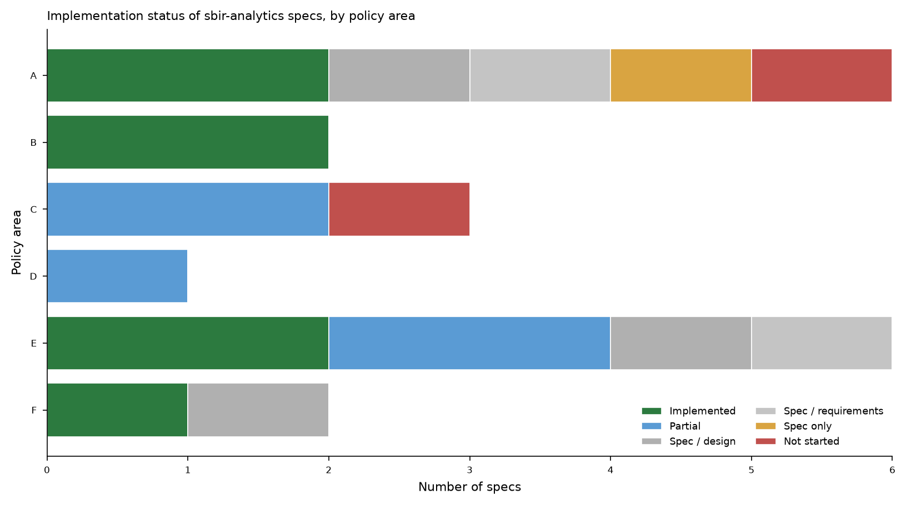

# Implementation Status Survey — `specs/` (what's built vs. still a research target)

**Source:** status banners and README headers across `specs/` and `docs/`, cross-read against
the A–F policy areas and the answerability labels in `docs/research-questions.md`. 20 specs
catalogued. Full table with evidence in `spec_status_summary.csv`.

## Summary counts

| Status | Specs |
|---|---|
| **Implemented** | 7 |
| **Partial** | 5 |
| **Spec / design** (design-only, not started) | 3 |
| **Spec / requirements** (requirements-only) | 2 |
| **Spec only** | 1 |
| **Not started** | 2 |

So ~⅓ of specs are fully built, ~¼ partially built, and the rest are design/requirements
artifacts. The implemented core sits in **commercialization (B)** and **data infrastructure
(E)**; the research frontier — and the highest-value unbuilt work — is concentrated in
**national security (A)**, **innovation/spillovers (C)**, and **capital formation (F)**.

## Implemented (answerable today)

- **merger_acquisition_detection (A)** — SBIR-firm M&A / exit detection; "implemented and
  merged." Runs as a CLI script (`detect_sbir_ma_events.py`), not an orchestrated Dagster asset.
- **sbir_ma_match_rate_by_fy (A)** — M&A match rate by fiscal year; emits JSONL artifacts.
- **company-categorization (B)** — product/service/mixed-mode firm classification; 51% threshold
  in the runtime schema; many "Completed" sub-assets.
- **phase-3-solicitation-alerts (B)** — Phase III candidate alerts as pandas predicate filters.
- **sbir-cohort-design (F)** — SBIR capital-cohort definition; implemented and merged.
- **unify-company-into-organization (E)** / **unify-graph-node-labels (E)** — graph node-label
  unification; categorization keyed on Organization UEIs.

## Partial (tools exist; end-to-end pipeline or some inputs missing)

- **cross-agency-taxonomy (C)** — the C1 portfolio tools are live (`mission_a/`: HHI per CET
  area, cross-agency company counts, geographic concentration, semantic clustering, gap
  detection) and the **CET classifier (C1d)** is implemented. *Missing:* the scheduled
  end-to-end Dagster reporting asset wiring them into a cross-agency view (C1a–c).
- **modernbert_analysis_layer (C)** — only the **core embedding layer** (~488 LOC) is built. The
  **Bayesian Mixture-of-Experts**, **LoRA expert routing**, and **three-stage Bayesian routing**
  are explicitly **deferred** (gated on C2b).
- **state-local-tax-rates (D)** — "not yet started, but significant existing implementation";
  the CSV reference file + provider (Reqs 1–2) were scoped out of the relevant PR.
- **data-imputation (E)** — archived/superseded at
  `specs/archive/superseded/data-imputation/`; replaced by
  `firm-identity-resolution` and `input-validation-hardening`. No live
  `sbir_etl/imputation/` module or `ImputationEntry` implementation remains.
- **load-contract-nodes (E)** — `RESULTED_IN` → CONTRACT FinancialTransaction resolution;
  piece-by-piece status table, mixed.

## Design / requirements only (specs written, no implementation)

- **naics-enricher-consolidation (A)** — requirements.md; consolidation pending.
- **ucc1-financing-analysis (A/F)** — detailed portal-level design (CA SOS bizfile, UCC-3
  lifecycle, image endpoints); data acquisition not started. Backs the A-CP9 distress signal.
- **iterative_api_enrichment (E)** — design.md, no status banner.
- **weekly-awards-report-refactor (E)** — requirements.md.
- **agency-private-capital-comparison (F)** — agency-parameterized SBIR-vs-private-capital design
  (NSF as initial target); not flagged implemented.
- **ot-consortium-subaward-attribution (A)** — "spec only"; follow-on to OT consortium work.

## Not started — design-only, zero code (the genuine research targets)

- **leverage-ratio-analysis (A)** — the **DoD ~4:1 leverage-ratio** flagship (A3). Spec is
  design-only, but prerequisites (entity resolution, SBIR identification, USAspending
  enrichment) are **all live on `main`** — so this is buildable now, not blocked.
- **patent-cost-spillover (C)** — marginal-cost-per-patent and the **Myers & Lanahan ~3×
  spillover** reproduction (C3a–c). Design-only, **zero implementation code**.

## Cross-reference to the literature map

The two areas where the *literature map* found the field thinnest — **A (choke-point/FOCI)** and
**F (capital formation)** — are also where the *codebase* has the most design-only / unbuilt
specs (A: 4 unbuilt + UCC-1; F: 2 design-only). The unbuilt work is not lagging the field; it
is **at the frontier**, which is consistent with the map's finding that these questions are not
yet covered by peer-reviewed SBIR-specific research. The two clearest "buildable now, high
policy value, design-only" targets are **leverage-ratio-analysis (A3)** and
**patent-cost-spillover (C3)** — both have published benchmarks (NASEM 4:1; Myers & Lanahan 3×)
to validate against.

*Files: `spec_status_summary.csv` (20 specs with area, status, evidence),
`spec_status.png` (status × policy-area overview).*
