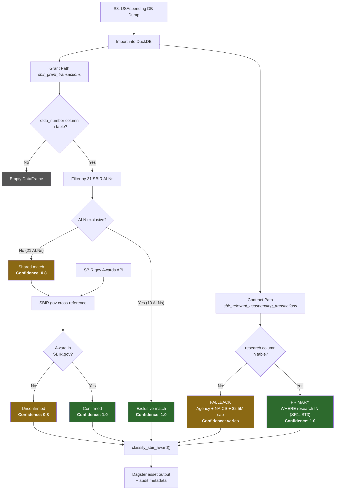

# SBIR/STTR Award Identification Methodology

This document describes how the sbir-analytics pipeline identifies SBIR and STTR awards
in federal spending data. It is organized into two sections:

1. **Policy Compliance** — regulatory basis, data provenance, and audit defensibility
2. **Technical Implementation** — data flows, algorithms, and fallback logic

---

## Part 1: Policy Compliance

### 1.1 Regulatory Framework

The Small Business Innovation Research (SBIR) and Small Business Technology Transfer
(STTR) programs are authorized by Congress under 15 U.S.C. &sect; 638 and administered
by the Small Business Administration (SBA). Eleven federal agencies with extramural R&D
budgets exceeding $100M are required to participate.

This pipeline identifies SBIR/STTR awards using identifiers defined by the following
authoritative sources:

| Identifier | Authority | Reference |
|------------|-----------|-----------|
| FPDS `research` field | Federal Procurement Data System | Data Dictionary Element 10Q, FAR 35.106 |
| Assistance Listing Numbers | General Services Administration (SAM.gov) | OMB Circular A-133, 2 CFR Part 200 |
| SBIR.gov award records | Small Business Administration | 15 U.S.C. &sect; 638 |

### 1.2 Data Provenance Chain

Every SBIR/STTR identification in this pipeline traces back to an authoritative federal
data system through a documented chain:

```
Contracting Officer (CO)
  ↓  Reports via FAR 4.6
Federal Procurement Data System (FPDS-NG)
  ↓  Nightly feed
USAspending.gov (DATA Act, P.L. 113-101)
  ↓  Database dump or API
This pipeline (DuckDB extraction)
  ↓  classify_sbir_award()
Neo4j graph / analytical outputs
```

For grants, the chain is:

```
Grants Management Officer (GMO)
  ↓  Reports via 2 CFR 200
Federal Assistance Broker Submission (FABS)
  ↓  Nightly feed
USAspending.gov
  ↓  Database dump
This pipeline (ALN-based filtering)
  ↓  Cross-referenced with SBIR.gov
Neo4j graph / analytical outputs
```

### 1.3 Identification Methods by Confidence Level

The pipeline uses three identification methods, in order of regulatory authority:

#### Tier 1: FPDS Research Field (Confidence: 1.0)

- **Scope:** Federal contracts (FPDS data)
- **Field:** `research` (Element 10Q)
- **Authority:** Contracting Officers code each SBIR/STTR action per FAR 35.106
- **Values:** SR1 (SBIR Phase I), SR2 (Phase II), SR3 (Phase III), ST1 (STTR Phase I), ST2 (Phase II), ST3 (Phase III)
- **False positive rate:** Zero by design — non-SBIR contracts have this field null
- **Audit claim:** "SBIR contracts identified via FPDS research field, the authoritative SBIR/STTR designator in federal procurement data (Data Dictionary Element 10Q, FAR 35.106)"

#### Tier 2: Assistance Listing Numbers (Confidence: 0.8–1.0)

- **Scope:** Federal grants and cooperative agreements (FABS data)
- **Field:** `cfda_number` (Assistance Listing Number)
- **Authority:** Program offices assign ALNs per OMB Circular A-133

Two sub-tiers:

| Sub-tier | Confidence | Example | Rationale |
|----------|------------|---------|-----------|
| Exclusive ALN | 1.0 | 12.910 (DOD SBIR) | ALN funds *only* SBIR/STTR awards |
| Shared ALN | 0.8 | 93.855 (NIH NIAID) | ALN funds SBIR *and* non-SBIR grants |

- **Exclusive ALN agencies:** DOD, NASA, NSF, USDA, EPA, DHS (10 ALNs)
- **Shared ALN agencies:** HHS/NIH, DOE, ED, DOT (21 ALNs)
- **Audit claim (exclusive):** "SBIR grants identified via Assistance Listing Number, which is exclusively designated for SBIR/STTR awards by the awarding agency"
- **Audit claim (shared):** "Candidate SBIR grants identified via Assistance Listing Number associated with SBIR programs, confirmed through SBIR.gov cross-reference"

#### Tier 3: Description Text Parsing (Confidence: 0.5–0.7)

- **Scope:** Fallback for records lacking Tier 1 or Tier 2 identifiers
- **Method:** Regex-based keyword detection in award descriptions
- **Keywords:** "SBIR", "STTR", "SMALL BUSINESS INNOVATION", "SMALL BUSINESS TECHNOLOGY", phase indicators ("Phase I/II/III")
- **False positive risk:** Moderate — descriptions mentioning SBIR in non-SBIR contexts
- **Audit claim:** "SBIR affiliation inferred from award description text; not independently confirmed via FPDS or ALN identifiers"

### 1.4 Agencies and Identifiers

| Agency | Contract ID Method | Grant ALN(s) | ALN Exclusive? |
|--------|-------------------|--------------|----------------|
| DOD | FPDS `research` SR1–SR3, ST1–ST3 | 12.910, 12.911 | Yes |
| DOE | FPDS `research` | 81.049 | No |
| NASA | FPDS `research` | 43.002, 43.003 | Yes |
| NSF | FPDS `research` | 47.041, 47.084 | Yes |
| HHS/NIH | FPDS `research` | 93.855, 93.859, +16 more | No |
| USDA | FPDS `research` | 10.212 | Yes |
| EPA | FPDS `research` | 66.511, 66.512 | Yes |
| DHS | FPDS `research` | 97.077 | Yes |
| DOT | FPDS `research` | 20.701 | No |
| ED | FPDS `research` | 84.133 | No |
| DOC/NIST | FPDS `research` | — | — |

### 1.5 Known Limitations and Mitigations

| Limitation | Impact | Mitigation |
|------------|--------|------------|
| FPDS `research` column may not exist in all dump formats | Falls back to heuristic filter | Logged as `sbir_filter_method: heuristic` in Dagster metadata |
| HHS/NIH shared ALNs produce false positives | ~20% of NIH ALN-matched grants may not be SBIR | Cross-reference with SBIR.gov bulk data |
| Description parsing has low precision | ~30% false positive rate without context | Only used when Tier 1 and Tier 2 unavailable; confidence capped at 0.7 |
| SBIR.gov API may be in maintenance | Cannot validate shared-ALN grants | Bulk download fallback (290MB with abstracts) |
| Phase III contracts may lack `research` code | Some agencies inconsistently code Phase III | Supplemented by description parsing |

### 1.6 Audit Trail Metadata

Every processed record includes provenance metadata:

| Field | Description | Example Values |
|-------|-------------|----------------|
| `sbir_filter_method` | Which identification tier was used | `fpds_research_field`, `heuristic` |
| `sbir_aln_confidence` | Grant identification confidence tier | `exclusive`, `shared` |
| `method` | Classification function result | `fpds_research_field`, `assistance_listing_number`, `description_parsing` |
| `confidence` | Numeric confidence score | `1.0`, `0.8`, `0.7`, `0.5` |

---

## Part 2: Technical Implementation

### 2.1 Architecture Overview

```
USAspending DB Dump (S3)
        │
        ▼
  ┌─────────────┐
  │   DuckDB     │  import_postgres_dump()
  │  Extractor   │
  └──────┬───────┘
         │
    ┌────┴─────┐
    │          │
    ▼          ▼
┌────────┐ ┌────────┐
│  FPDS  │ │  FABS  │
│ (contr)│ │(grants)│
└───┬────┘ └───┬────┘
    │          │
    ▼          ▼
┌────────┐ ┌────────┐     ┌───────────┐
│research│ │  ALN   │────▶│ SBIR.gov  │
│ field  │ │ filter │     │ cross-ref │
│ filter │ │        │     └───────────┘
└───┬────┘ └───┬────┘
    │          │
    ▼          ▼
┌──────────────────────┐
│  classify_sbir_award()│
│  Unified classifier   │
└──────────┬────────────┘
           │
           ▼
    Dagster asset output
    (DataFrame + metadata)
```

### 2.2 Contract Identification (FPDS Path)

**Dagster asset:** `sbir_relevant_usaspending_transactions`
**Module:** `packages/sbir-analytics/sbir_analytics/assets/usaspending_database_enrichment.py`

#### Step 1: Import dump into DuckDB

```python
extractor = DuckDBUSAspendingExtractor(db_path=config.duckdb.database_path)
extractor.import_postgres_dump(dump_path, "transaction_normalized")
physical_table = extractor.resolve_physical_table_name("transaction_normalized")
```

The dump is a PostgreSQL archive containing `.dat.gz` COPY files. The extractor
decompresses and loads them as DuckDB tables with OID-based naming, then creates
views with semantic names.

#### Step 2: Detect column availability

```python
has_research_col = _table_has_column(extractor, physical_table, "research")
```

Uses `DESCRIBE` (schema-only, no table scan) to check if the FPDS `research`
column exists. This is necessary because the `transaction_normalized` table
schema varies between dump versions — some include FPDS-specific columns,
others do not.

#### Step 3a: Primary filter (research field present)

```sql
SELECT ...
FROM transaction_normalized
WHERE research IN ('SR1','SR2','SR3','ST1','ST2','ST3')
  AND federal_action_obligation > 0
```

- No agency filter needed — the research codes *are* the SBIR filter
- No NAICS filter needed — any NAICS can receive SBIR funding
- No dollar cap needed — the research code is definitive regardless of amount
- Includes the `research` column in output for downstream phase classification

#### Step 3b: Fallback filter (research field absent)

```sql
SELECT ...
FROM transaction_normalized
WHERE (awarding_agency_name IN (...) OR funding_agency_name IN (...))
  AND (naics_code LIKE '5417%' OR ...)
  AND federal_action_obligation <= 2500000
  AND federal_action_obligation > 0
```

Heuristic filter using:
- 11 SBIR-participating agency names (both abbreviation and full name)
- 5 NAICS code prefixes common in SBIR companies
- $2.5M obligation cap (above Phase II maximum)

This is a *necessary* but not *sufficient* filter — it captures SBIR awards
but also non-SBIR contracts from those agencies/NAICS codes.

#### Step 4: SBIR.gov cross-reference (heuristic fallback only)

When the heuristic filter is used, the asset automatically cross-references
results against SBIR.gov to tag which records are confirmed SBIR awards:

1. Builds a `SbirGovLookupIndex` via API (falls back to bulk download)
2. Matches each record by award number, UEI, or DUNS
3. Adds columns: `sbir_gov_confirmed` (bool), `sbir_gov_match_key`
   (audit trail: `"contract"`, `"uei"`, or `"duns"`),
   `sbir_gov_program`, `sbir_gov_phase`, `sbir_gov_topic_code`, `sbir_gov_firm`

When the authoritative `research` field is used (Step 3a), this step is
skipped — every record is already definitively SBIR/STTR.

#### Step 5: Metadata tagging

The Dagster asset metadata includes `sbir_filter_method` set to either
`fpds_research_field` or `heuristic`, making the identification method
explicit for downstream consumers. When cross-referenced, additional metadata
includes `sbir_gov_confirmed` and `sbir_gov_unconfirmed` counts.

### 2.3 Grant Identification (FABS Path)

**Dagster asset:** `sbir_grant_transactions`
**Module:** `packages/sbir-analytics/sbir_analytics/assets/usaspending_database_enrichment.py`

#### Step 1: Import and schema detection

Same DuckDB import as the contract path. Checks for `cfda_number` column
presence. Returns an empty DataFrame with `reason: no_cfda_column` metadata
if the column is absent.

#### Step 2: ALN-based filtering

```sql
SELECT *,
    CASE
        WHEN cfda_number IN ('10.212','12.910','12.911',...) THEN 'exclusive'
        ELSE 'shared'
    END AS sbir_aln_confidence
FROM transaction_normalized
WHERE cfda_number IN (<all 31 SBIR ALNs>)
  AND federal_action_obligation > 0
```

The query tags each matching record with its confidence tier inline,
avoiding a post-query join.

#### Step 3: SBIR.gov cross-reference for shared-ALN grants

After the initial ALN filter, the asset automatically cross-references
shared-ALN records against SBIR.gov:

1. Identifies which agencies have shared (non-exclusive) ALNs
   (HHS, DOE, ED, DOT)
2. Builds a `SbirGovLookupIndex` by querying those agencies (API first,
   bulk download fallback)
3. Matches each record by award number, UEI, or DUNS against the index
4. Adds columns: `sbir_gov_confirmed` (bool), `sbir_gov_match_key`
   (audit trail: `"contract"`, `"uei"`, or `"duns"`),
   `sbir_gov_program`, `sbir_gov_phase`, `sbir_gov_topic_code`, `sbir_gov_firm`
5. Upgrades confirmed shared-ALN records: `sbir_aln_confidence` changes
   from `shared` to `shared_confirmed`

#### Step 4: Output with confidence tiers

The output DataFrame includes:
- All original FABS fields
- `sbir_aln_confidence` column: `exclusive`, `shared_confirmed`, or `shared`
- SBIR.gov enrichment columns (when cross-reference succeeds)
- Dagster metadata: `exclusive_aln_matches`, `shared_aln_matches`,
  `sbir_gov_shared_confirmed`, `sbir_gov_shared_unconfirmed`

### 2.4 SBIR.gov Cross-Reference

**Module:** `sbir_etl/extractors/sbir_gov_api.py` (client)
**Integration:** `packages/sbir-analytics/sbir_analytics/assets/usaspending_database_enrichment.py` (`_build_sbir_gov_index`, `_crossref_dataframe_with_sbir_gov`)

#### Data acquisition (two-tier fallback)

```
_build_sbir_gov_index()
  ├── Attempt 1: SBIR.gov API
  │     SbirGovClient.query_all_awards(agency=...) for each target agency
  │     Paginated, with tenacity retry on transport errors
  │
  └── Attempt 2: Bulk download file (API unavailable or returned 0 results)
        Checks: s3://<bucket>/raw/sbir_gov/awards.json
        Then:   data/raw/sbir_gov/awards.json
```

Both paths produce a `SbirGovLookupIndex` — a multi-key index supporting
lookup by contract number, UEI, or DUNS.

#### Cross-reference workflow

1. `_build_sbir_gov_index()` queries SBIR.gov for target agencies
   (shared-ALN agencies for grants, all agencies for heuristic contracts)
2. `SbirGovLookupIndex` indexes awards by contract number, UEI, and DUNS
3. `_crossref_dataframe_with_sbir_gov()` iterates over the DataFrame and
   looks up each record by award ID → UEI → DUNS (in priority order)
4. Adds columns: `sbir_gov_confirmed` (bool), `sbir_gov_match_key`
   (audit provenance: `"contract"`, `"uei"`, or `"duns"`),
   `sbir_gov_program`, `sbir_gov_phase`, `sbir_gov_topic_code`, `sbir_gov_firm`
5. For grants: upgrades `sbir_aln_confidence` from `shared` to `shared_confirmed`
6. For contracts: tags heuristic results as confirmed or unconfirmed

#### Where cross-reference runs

| Asset | Trigger | Target records |
|-------|---------|----------------|
| `sbir_relevant_usaspending_transactions` | Heuristic fallback (no `research` column) | All heuristic results |
| `sbir_grant_transactions` | Shared-ALN grants exist | Shared-ALN records (HHS, DOE, ED, DOT) |

When the authoritative FPDS `research` field is available, no cross-reference
is needed for contracts — the research code is definitive.

### 2.5 Unified Classification Function

**Function:** `classify_sbir_award()`
**Module:** `sbir_etl/models/sbir_identification.py`

Accepts any combination of available identifiers and returns the highest-confidence
classification:

```python
result = classify_sbir_award(
    research_code="SR2",       # from FPDS
    cfda_number="12.910",      # from FABS
    description="SBIR Phase II development",  # from either
)
# Returns: {"program": "SBIR", "phase": 2, "method": "fpds_research_field", "confidence": 1.0}
```

Priority order:
1. `research_code` → `parse_research_code()` → confidence 1.0
2. `cfda_number` → `is_sbir_grant()` → confidence 1.0 (exclusive) or 0.8 (shared)
3. `description` → `_parse_sbir_from_description()` → confidence 0.5–0.7

The function short-circuits at the first match — it does not combine signals.
This is intentional: mixing tiers would complicate audit provenance.

### 2.6 Reference Data

All identification constants are defined in `sbir_etl/models/sbir_identification.py`:

- `SbirResearchCode` enum — the 6 FPDS codes
- `SBIR_RESEARCH_CODES` frozenset — for SQL `IN` clauses
- `SBIR_ASSISTANCE_LISTING_NUMBERS` dict — per-agency ALNs with `exclusive` flag
- `ALL_SBIR_ALNS` / `EXCLUSIVE_SBIR_ALNS` frozensets — for quick membership tests

Updating these constants (e.g., when a new agency joins SBIR or an ALN changes)
requires only modifying this single module — all downstream consumers inherit
the change.

### 2.7 Error Handling and Degradation

| Failure Mode | Behavior |
|-------------|----------|
| `research` column missing | Falls back to heuristic + SBIR.gov cross-ref; logged as warning |
| `cfda_number` column missing | Returns empty DataFrame; metadata includes `reason` |
| SBIR.gov API down | Falls back to bulk download file |
| SBIR.gov API + bulk both fail | Graceful: grants retain `shared` confidence, heuristic contracts lack confirmation; metadata: `sbir_gov_status: unavailable` |
| DuckDB import fails | Raises `ExtractionError` with component/operation context |
| S3 bucket not configured | Raises `ExtractionError` immediately |

### 2.8 Process Flow Diagram


