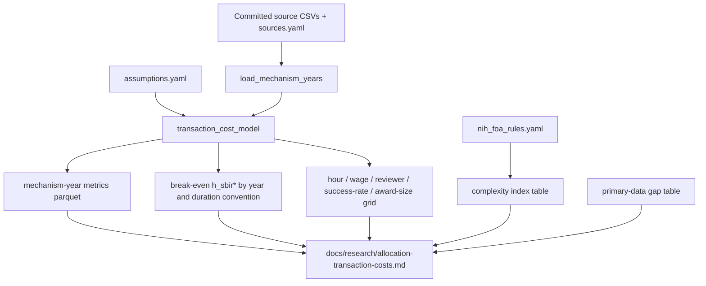

<!-- Approved implementation plan for this spec. Copied into the
repository so the plan ships with the PR; the frozen study method is
studies/allocation-transaction-costs/design.md. -->

# Allocation transaction costs: NIH SBIR vs R01

## What this PR will actually decide

Public data can measure applications, awards, success rates, and award size for NIH SBIR/STTR versus NIH R01-equivalent grants. It cannot measure applicant hours or reviewer hours for small-business proposals. The honest product of this PR is therefore:

1. A mechanism-year comparison of **hours per award**, **dollars per award**, and **cost per awarded dollar**, kept separate.
2. An algebraic and empirical **break-even SBIR proposal burden**: how many applicant hours an NIH SBIR Phase I proposal could consume before its transaction cost per awarded dollar equals an R01.
3. A labeled source inventory and a table of what still requires primary data.
4. One of four conclusions, chosen from evidence rather than forced: hypothesis supported, contradicted, **depends on observable assumptions**, or **currently underidentified**.

The expected conclusion, given the size gap between R01-equivalent awards (~$600k *annual* in recent NIH Nexus tables) and SBIR Phase I (~$250–300k *total project*), is that ranking by cost-per-awarded-dollar is dominated by award size and success rate. Directional claims about “SBIR is cheaper to allocate” are underidentified until applicant hours are observed. The break-even condition is the result.

This question is **not in the inventory today**. The PR adds it as a new C4 question, a lean exploratory spec, and a study modeled on `form-d-fundraising` (frozen design + script + research note), not on `phase-iii-census` (Dagster + SHA-gated materialization).

**Target epistemic tier:** exploratory analysis over committed public tables. Study `evidence_status`: `reproducible` if NIH Data Book extracts are committed and hashed; otherwise `exploratory`. Inventory Status: `Partially computable` only if the study is `reproducible`; never `Validated` or `Citable`. Permitted claims will not include a directional efficiency ranking.

---

## Why this belongs here, and what it must not become

`docs/research-questions.md` currently asks whether SBIR produces knowledge (C), fiscal return (D), or identifiable follow-on (B). It does not ask whether SBIR is a cheaper *allocation mechanism* than investigator-initiated grants. That is an R&D-policy question with GAO/OMB/OSTP readers, so it goes in **C**, not E (pipeline infrastructure) and not D (tax ROI).

Do **not**:

- Put this in `sbir_etl/` or the modular analysis platform (`analysis_kind` is only `tech_census` / `transition_cohort`).
- Add Dagster assets, Neo4j loaders, or live NIH RePORTER R01 harvest as a run dependency.
- Treat PRA burden hours, university F&A rates, or the SBIR administrative-funding allowance as observed total cost.
- Combine SBIR and STTR, or Phase I and Phase II.
- Collapse the three outcomes into one efficiency score.
- Promote to `evidence` / `citable`.

Reuse the form-d pattern: `studies/<id>/{study.yaml,design.md}` + `scripts/data/` calculator + `docs/research/` findings note + unit tests of the algebra.

---

## Conceptual model (frozen in `design.md`)

Allocation transaction cost for mechanism `m`:

```
TC_m = AC_m + RC_m + GC_m
```

- Applicant hours per funded award: `A_m = (applications_m / awards_m) * hours_per_application_m`
- Dollarized applicant cost: `AC_m = A_m * awards_m * labor_cost_per_hour`  
  equivalently `applications_m * hours_per_application_m * labor_cost_per_hour`
- Review cost: `RC_m = applications_m * reviewers_per_application_m * reviewer_hours_m * reviewer_labor_cost`
- Agency cost: `GC_m` = attributable selection/admin dollars, or a declared lower bound / missing

Report, never mix:

| Outcome | Formula |
|---|---|
| Transaction hours per funded award | `(applicant hours + review hours) / awards` |
| Transaction dollars per funded award | `(AC + RC + GC) / awards` |
| Transaction cost per dollar awarded | `(AC + RC + GC) / dollars_awarded` |

Also report raw hours and the un-dollarized components. Wage conversion is a scenario, not the default headline.

**Break-even applicant hours** (same wage, ignore GC unless a lower bound is attached to both sides):

```
h_sbir* = h_r01 * (s_sbir * D_sbir) / (s_r01 * D_r01)
```

where `s` is awards/applications and `D` is mean award dollars under a **declared duration convention**.

Wage cancels when it is common. The ranking is identified by `(s * D)` and `h`. Sensitivity must show which of those actually moves the result.

**Duration convention is a first-class identifying assumption**, not a footnote. NIH “average size of R01-equivalent awards” in the Nexus/Data Book tables is an *annual* cost. SBIR Phase I is a *project* total of ~6–12 months. Comparing annual R01 dollars to total Phase I dollars understates the R01 size advantage; comparing a 4-year R01 total to Phase I overstates it. The study must compute both conventions and label them.

---

## What public data can establish (inventory, not aspiration)

### Identified with published administrative data (NIH)

NIH Data Book / RePORT is the primary source. It already publishes competing applications, awards, and success rates by mechanism and year, with explicit activity-code definitions:

- R01-equivalent (Data Book report 29): DP1, DP2, DP5, R01, R37, R56, RF1, RL1, U01, and selected R35. [report.nih.gov/nihdatabook/category/10](https://report.nih.gov/nihdatabook/category/10)
- SBIR Phase I / Phase II / Fast Track (reports 115, 116, 272, 96): R43, R44, SB1, U43, U44. [report.nih.gov/nihdatabook/category/8](https://report.nih.gov/nihdatabook/category/8)
- RePORT success-rate Excel workbooks by IC, mechanism, and activity code, including total and average funding: [report.nih.gov/funding/.../success-rates](https://report.nih.gov/funding/nih-budget-and-spending-data-past-fiscal-years/success-rates)
- FY2023–2025 Nexus summary (R01-equivalent applications, competing awards, success rate, average size): [grants.nih.gov Nexus, Mar 2026](https://grants.nih.gov/news-events/nih-extramural-nexus-news/2026/03/fiscal-year-2025-by-the-numbers-extramural-grant-investments-in-research)

These are **accounting / administrative counts**, not behavioral hours.

NIH RePORTER (`sbir_etl/enrichers/nih_reporter/`) is award-level and currently filtered to R43/R44/R41/R42. It can *cross-check* award counts and obligated dollars if a local cache exists. It cannot produce application counts. The study must run without a live RePORTER fetch.

### Identified with published administrative data (other agencies, assessment only in this PR)

SBA SBIR/STTR Annual Reports publish new proposals received, new awards, selection rate, and obligations by agency, program, and phase ([L18]; FY22 PDF is already cited). Example: DoD SBIR Phase I FY22, 6,444 proposals / 1,172 awards / 18% selection; HHS STTR Phase I, 1,163 / 214 / 18%. GAO-25-107942 reports FY2023 proposal counts and acceptance rates for open vs conventional topics (HHS, DoD, DOE).

NSF merit-review / budget request tables give research-grant funding rates (~24–27%) separately from NSF SBIR Phase I full-proposal rates (~10–20%). NSF’s Project Pitch funnel means full-proposal counts understate applicant effort if pitches are ignored.

### Observed behavioral hours: weak, and the wrong population

FDP Faculty Workload Surveys (2007, 2012, 2018) measure university PI time on federal projects, not small-business proposal hours. 2018: 44.3% of research time on requirements; proposal preparation 16.0% of research time; median 4 proposals in 3 years. That is **measured behavioral data for a different applicant type**. Transferring it to SBIR firms is an assumption and must be labeled as such.

PRA/OMB Control Number filings (e.g. NIH competing applications 0925-0001; SBIR-specific collections) are **administrative estimates**, not observed writing time. Do not use them as `hours_per_application`.

No public survey of NIH SBIR applicant hours was found that matches FDP quality. That is the central evidence gap.

### Reviewer burden: partially proxied

NIH CSR typically assigns ~3 reviewers per application; NSF SBIR states 3–10 external reviewers. Hours per review are not published as a time-use survey. Use scenario ranges (e.g. 2, 4, 8 hours) and keep them in `assumptions.yaml`.

### Agency administrative cost: lower bound only

15 U.S.C. §638 allows agencies to use not more than **3%** of SBIR program funds for administration, outreach, reporting, and related activities (plus a separate due-diligence allowance). That is incremental statutory funding, not total selection cost, and not comparable to NIH CSR’s whole-institute budget. Report `admin_allowance / award_dollars ≤ 0.03` as a **lower-bound ceiling on extra SBIR-specific admin**, never as `GC`. If total agency selection cost cannot be allocated to SBIR vs R01 from public records, leave `GC` missing and say so.

Do not use university F&A rates.

### Proposal-complexity index: observable, not hours

NIH FOAs publish page limits and required attachments. A hand-coded YAML for current NIH SBIR/STTR vs R01 (PHS 398 / FORMS) can record: research-strategy pages (6 vs 12), commercialization plan, registrations, certifications, letters, human-subjects, consortium/RI coordination (STTR). This is a **proxy for formal complexity**, not hours. Do not scrape the full FOA corpus in this PR.

---

## Architecture



Grain: **mechanism × fiscal year × duration_convention**, not firm or award. Identity policy: none. No `sbir_etl.identity` work.

Every derived number traces to a source field or a named assumption key. Unit tests fail if a numeric literal appears in the calculator outside the assumptions loader.

---

## Repository layout (new)

```text
specs/allocation-transaction-costs/
  requirements.md
  design.md          # code layout + what is out of scope; points at the frozen study design
  tasks.md

studies/allocation-transaction-costs/
  study.yaml
  design.md          # frozen estimand, formulas, duration conventions, what would make it wrong
  sources.yaml       # URL, retrieved_on, publisher, definition, evidence_class, years
  assumptions.yaml   # hours grids, wages, reviewers, GC handling
  data/              # committed NIH Data Book / RePORT extracts
  complexity/nih_foa_rules.yaml

scripts/data/allocation_transaction_costs.py   # CLI + pure functions (keep one module unless it exceeds ~400 lines)

docs/research/allocation-transaction-costs.md
docs/research-questions.md                     # add C4
specs/status.md                                # Active, exploratory
```

Generated artifacts land under `data/reports/allocation-transaction-costs/` (gitignored like other reports). The research note commits the tables that the reader needs; it does not depend on a local data dump.

If the calculator grows, split into `scripts/data/allocation_transaction_costs/{model,load,sensitivity,cli}.py` rather than adding a package.

**CLI:**

```bash
uv run python scripts/data/allocation_transaction_costs.py \
  --sources studies/allocation-transaction-costs/sources.yaml \
  --assumptions studies/allocation-transaction-costs/assumptions.yaml \
  --out data/reports/allocation-transaction-costs
```

---

## Implementation plan

### 1. Inventory and scope gate

- Add **C4. Allocation costs** to `docs/research-questions.md` under C (after C3). One question, plain language:

  **SBIR vs conventional-grant allocation costs**  
  Does SBIR/STTR allocate federal R&D funding with lower transaction hours and dollars, per award and per awarded dollar, than conventional federal research grants, after accounting for award size, success rate, proposal burden, review burden, and agency administrative costs?  
  **Status:** Partially computable for NIH SBIR Phase I vs R01-equivalent under the `allocation-transaction-costs` study (`reproducible`, not validated, not citable), as a break-even condition over declared hour and duration assumptions. Directional ranking is underidentified. Other agencies are inventory-only in this study.  
  *Deps: none (published mechanism-year tables) · Refs: [L3], [L6], [L18], plus new L# for FDP, NIH Data Book, 15 U.S.C. §638 admin allowance · Spec / Study: paths*

- Add C4 to OSTP and SBIR program-manager **research targets**, not Start here.
- Add literature entries for NIH Data Book / RePORT success-rate tables, FDP 2018 Faculty Workload Survey, 15 U.S.C. §638 administrative-funding allowance, and GAO-25-107942 (proposal/acceptance rates). Use the next free `[L#]` slots.
- Register the spec in `specs/status.md` as **Active**, target tier **exploratory**.
- Write `requirements.md` from the template: research question C4, exploratory tier, done-when = an analyst can state the NIH break-even hours under two duration conventions and name the missing primary data. Out of scope listed below.

### 2. Source inventory and committed NIH tables

Hand-transcribe or export (Data Book “Export”) the overlapping years for:

- R01-equivalent competing applications, awards, success rate, and average award size
- SBIR Phase I, Phase II, Fast Track (keep Fast Track separate)
- STTR Phase I / Phase II if Data Book or RePORT activity-code tables provide them; if not, record STTR as a gap rather than folding into SBIR

`sources.yaml` fields per table: `source_id`, `url`, `retrieved_on`, `publisher`, `report_id`, `definition_verbatim`, `activity_codes`, `years`, `evidence_class` (`administrative_count` | `accounting` | `behavioral_survey` | `pra_estimate` | `proxy` | `statutory_cap`), `denominator_notes`.

SHA-256 of each committed CSV goes in `sources.yaml` and is checked at load time (same spirit as study frozen artifacts, without pretending this is evidence-tier).

Optional, non-blocking: if a local NIH RePORTER cache exists, emit a reconciliation appendix of award counts/dollars vs Data Book. Never fail the study when the cache is absent.

### 3. Assumptions file

`assumptions.yaml` holds every number that is not a source field:

- Applicant hour scenarios: 20, 40, 60, 80, 100, 150, 200 for SBIR Phase I
- R01 hour scenarios: an empirically supported range drawn from FDP / literature, each cited, **labeled as university-PI transfer**
- Labor rates: at least two (e.g. BLS life-scientist wage; NIH cap-adjacent fully loaded rate), cited
- Reviewers per application and reviewer hours (ranges)
- Whether GC is `missing` or `sbir_admin_allowance_ceiling_3pct` (lower bound only, SBIR side)
- Duration conventions: `annual_award_size` vs `project_total` (R01 project total = annual size × assumed years; years is itself an assumption, default 4, sensitivity 3/5)

No default “best” hour estimate. The research note’s headline is the break-even, not a preferred cell.

### 4. Calculator

Pure functions, deterministic, no network:

1. `load_mechanism_years` → normalized frame: `agency, mechanism, program, phase, fiscal_year, applications, awards, success_rate, dollars_awarded, mean_award_size, duration_convention, source_id, evidence_class`
2. `applicant_hours_per_award`, `review_hours_per_award`
3. `tc_per_award`, `tc_per_award_dollar` with AC/RC/GC components
4. `breakeven_sbir_hours(h_r01, s_sbir, D_sbir, s_r01, D_r01)` and the reviewer analogue
5. Sensitivity grid over hours, wages, reviewers, success rates (± relative shocks), award size
6. Tornado / rank-of-assumptions table: which inputs flip `TC_per_dollar(SBIR) ? TC_per_dollar(R01)`

NIH SBIR Phase I vs R01-equivalent is required. Phase II and STTR rows are computed when source rows exist; they are not combined with Phase I/SBIR.

### 5. Proposal-complexity index (NIH pair only)

Hand-code current NIH SBIR/STTR vs R01 FOA rules into YAML. Emit a comparison table (page limits, attachments, commercialization plan, certifications, RI coordination). State explicitly: this does not measure hours.

### 6. Administrative-cost note

Document the 3% allowance, the due-diligence add-on, and why CSR/extramural-management budgets cannot be allocated to SBIR vs R01 from public data. If SBA annual reports or agency congressional justifications give SBIR-admin dollars for any year, record them as a lower bound with the same `evidence_class: accounting` / `statutory_cap` distinction.

### 7. Other-agency assessment (findings, not datasets)

A section of the research note, backed by `sources.yaml` rows even when no normalized series is built:

| Agency | Applications/awards | Comparator grants | Verdict this PR |
|---|---|---|---|
| NSF | SBA annual report + NSF SBIR full-proposal rates; Project Pitch unpublished | NSF research-grant funding rate exists | Comparable only with a declared pitch-funnel caveat; **do not build** the series until pitch counts exist or are explicitly excluded |
| DOE | SBA annual report + DOE SBIR stats | Office of Science success rates are incomplete / differently defined | **Not yet matched** |
| NASA | SBA annual report; NASEM NASA review [L48] | No clean NSPIRES research-grant application series in this repo | **Not yet matched** |
| DoD | SBA annual report has component proposal counts | “Conventional DoD research grant” is not one mechanism (6.1/6.2 BAAs) | **Usable SBIR rates; unmatched comparator** |

This satisfies “assess whether comparable analyses are possible” without pretending they are implemented.

### 8. Research note (required output)

`docs/research/allocation-transaction-costs.md`, non-citable, following form-d tone:

1. What public data can and cannot establish
2. NIH Phase I vs R01 tables (applications per award, dollars per application, dollars per award, hours per $1M under the hour grid)
3. Break-even `h_sbir*` by year, both duration conventions, algebraic identity then empirical values
4. Sensitivity: which assumptions flip the ranking
5. Complexity-index table (proxy only)
6. Admin-cost lower bound / missing `GC`
7. **Primary-data gap table** (required): applicant hours for SBIR firms; SBIR reviewer time; allocated agency selection cost; NSF pitch funnel; DoD comparator; STTR if Data Book is silent
8. Recommended next steps (survey of SBIR applicants; CSR time-use; agency admin cost allocation)
9. Conclusion: one of the four allowed labels

### 9. Study contract

`studies/allocation-transaction-costs/study.yaml`:

- `research_questions: [C4]`
- `evidence_status: reproducible` (if CSVs + design are pinned) else `exploratory`
- Estimand: mechanism-year transaction hours and dollars per award and per awarded dollar for NIH SBIR/STTR vs NIH R01-equivalent, under declared duration and hour assumptions; plus the break-even SBIR hour threshold. Not a welfare estimate, not a quality-of-science estimate, not a causal effect of SBIR.
- `identity_policy`: grain is published mechanism-year statistics; no firm matching; `negative_evidence_allowed: false`
- `materialization.allowed: true` for the script; no Dagster
- Permitted claims: the calculation is deterministic given the pinned tables and YAML; the NIH comparison is a break-even / sensitivity result; numbers leaving the repo are non-citable
- Limitations: hours are assumed; FDP is the wrong population; duration convention moves the ranking; GC is missing or a statutory ceiling; success-rate denominators follow NIH’s competing-application definition (unique applications in a fiscal year), which is not NSF’s funding rate

Freeze `studies/allocation-transaction-costs/design.md` and hash it. Implementation symbol: the CLI `main` plus `breakeven_sbir_hours`.

---

## Tests (exploratory-scaled, but the algebra is load-bearing)

`tests/unit/scripts/test_allocation_transaction_costs.py` on synthetic tables:

- Break-even identity: if `h_sbir = h_r01 * (s_sbir * D_sbir) / (s_r01 * D_r01)`, then `TC_per_dollar` matches
- Three outcomes remain distinct (a test that they are not a single score)
- SBIR vs STTR and Phase I vs Phase II are not summed
- Missing `GC` stays missing, not zero
- PRA / F&A keys cannot be passed as `hours_per_application`
- Loader refuses a CSV whose SHA does not match `sources.yaml`
- No unexplained numeric literals in the model module (grep or a small AST check)
- Study manifest validates (`test_repository_study_manifests_are_valid` will pick it up)
- `check_research_question_status` still passes: C4 Status uses `Partially computable` only if the study is `reproducible`

Do not add integration tests that hit NIH or SBA.

---

## Out of scope for this PR

- NSF/DOE/NASA/DoD normalized series
- Live RePORTER R01 ingest or expanding `NIH_ACTIVITY_CODES`
- Dagster, Neo4j, weekly report, analysis-profile registry
- Causal identification, research quality, or welfare
- Post-award compliance burden (FDP post-award shares are recorded as *not* in `TC`)
- Scraping FOAs at scale
- Evidence-tier promotion or a Start-here listing
- Using this to mark any other research question computable

---

## Files to add or edit

| Path | Action |
|---|---|
| `docs/research-questions.md` | Add C4, research-target bullets, new `[L#]` |
| `specs/status.md` | Register spec Active / exploratory |
| `specs/allocation-transaction-costs/{requirements,design,tasks}.md` | New |
| `studies/allocation-transaction-costs/*` | New study, sources, assumptions, NIH CSVs, FOA YAML |
| `scripts/data/allocation_transaction_costs.py` | New calculator + CLI |
| `tests/unit/scripts/test_allocation_transaction_costs.py` | New |
| `docs/research/allocation-transaction-costs.md` | Findings + gap table |
| `notebooks/BACKLOG.md` | Optional: note that this is a study, not a notebook exploration |

---

## Verification

1. `uv run pytest tests/unit/scripts/test_allocation_transaction_costs.py tests/unit/quality/test_study_manifest.py tests/unit/scripts/test_research_question_status.py`
2. `uv run python scripts/ci/check_research_question_status.py`
3. Run the CLI on the committed NIH tables; confirm break-even table has one row per year × duration convention
4. Read the research note and confirm it ends with one of the four allowed conclusions and does not treat PRA or F&A as hours

---

## Likely finding (for implementers; do not pre-write the note)

Under the annual-size convention, NIH R01-equivalent currently delivers several times more awarded dollars per application than SBIR Phase I (roughly: ~19% success × ~$600k vs ~10–16% success × ~$300k). The break-even SBIR hour count is then a small fraction of R01 hours. That is exactly the competing hypothesis. The PR should make that ratio visible and refuse a point ranking.
